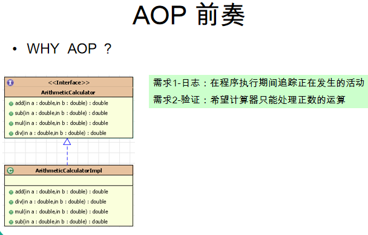
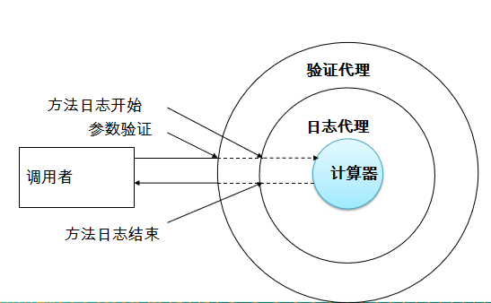
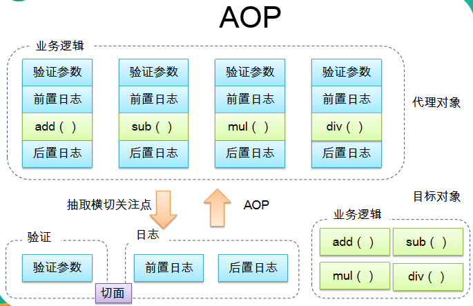

#### Aop 前言基础

######1.需求



日志以及验证者两大功能功能都在业务代码中显示冗余

######2.正常代码实现：


2.1 这样的代码后果：

> - 代码混乱：越来越多的非业务需求(日志和验证等)加入后, 原**有的业务方法急剧膨胀.  每个方法在处理核心逻辑的同时还必须兼顾其他多个关注点.** 
> - 代码分散: 以日志需求为例, 只是为了满足这个单一需求, 就不得不在多个模块（方法）里多次重复相同的日志代码. **如果日志需求发生变化, 必须修改所有模块.**

2.2 解决方案：

**<u>==动态代理设计模式：==</u>**

使用动态代理解决上述问题：

> 代理设计模式的原理: **使用一个代理将对象包装起来,** 然后用该代理对象取代原始对象. 任何对原始对象的调用都要通过代理. 代理对象决定是否以及何时将方法调用转到原始对象上.



######3.实现代码：

**3.1 第一种代理类 -- 实现InvocationHandler接口，并静态方法返回对应的代理实现类**

3.1.1 计算器日志代理器-.java

```java
package com.cxx.aop.prelude.handle;
import java.lang.reflect.InvocationHandler;
import java.lang.reflect.Method;
import java.lang.reflect.Proxy;
import java.util.Arrays;
/**
 * Calculatord的日志代理类 -- 第一种写法
 */
public class CalculatorLoggingHandler implements InvocationHandler {
    private Object target; // 目标
    public CalculatorLoggingHandler(Object target) {
        super();
        this.target = target;
    }
    public Object invoke(Object proxy, Method method, Object[] args) throws Throwable {
        System.out.println("日志输出： The method " + method.getName() + "() begins with " + Arrays.toString(args));
        // method.invoke(target,args); method.invoke一定是目标实例，并且是这些方法
        Object result = method.invoke(target,args);
        System.out.println("日志输出： The method " + method.getName() + "() ends with" + result);
        return result;
    }
    public static Object createProxy(Object target) {
        return Proxy.newProxyInstance(target.getClass().getClassLoader(),
                target.getClass().getInterfaces(),new CalculatorLoggingHandler(target));
    }
}
```


3.1.2 Calculator的验证代理器 .java

```java
package com.cxx.aop.prelude.handle;

import java.lang.reflect.InvocationHandler;
import java.lang.reflect.Method;
import java.lang.reflect.Proxy;

/**
 * Calculator的验证代理器 -- 第一种写法
 */
public class CalculatorValidationHandler implements InvocationHandler{
    private Object target;
    public CalculatorValidationHandler(Object target) {
        this.target = target;
    }
    /**
     *
     * @param proxy 正在返回的代理的对象，一边拿情况下，在invoke 方法中都不是用该对象。因为proxy也要进行生成后才可以被调用，所以每次调用对要回到这里，所以会生成死循环
     * @param method 正在被调用的方法
     * @param args 调用方法时，传入的参数
     * @return
     * @throws Throwable
     */
    public Object invoke(Object proxy, Method method, Object[] args) throws Throwable {
      System.out.println("方法调用 - 开始： The method " + method.getName());
        // 验证操作
        for (Object arg: args) {
            validate((Integer) arg);
        }
        Object result = method.invoke(target,args);
System.out.println("方法调用 - 结束： The method " + method.getName());
        return result;
    }
    public static Object createProxy(Object target) {
        return Proxy.newProxyInstance(target.getClass().getClassLoader(),
                target.getClass().getInterfaces(),
                new CalculatorValidationHandler(target));
    }
    private void validate(Integer arg) {
        if (arg<0) throw new IllegalArgumentException("Positive numbers only") ;
    }
}
```


3.1.3 调用：

```java
        // 第一种方法的实现调用： 先写日志，再写验证
        ArithmeticCalculator arithmeticCalculatorImpl = new ArithmeticCalculatorImpl();

      ArithmeticCalculator arithmeticCalculator =
                (ArithmeticCalculator) CalculatorValidationHandler.createProxy(CalculatorLoggingHandler.createProxy(arithmeticCalculatorImpl));
        System.out.println(arithmeticCalculator.mul(5,6));
        System.out.println(arithmeticCalculator.add(-12,13));
```


**3.2 第二种代理类 -- 不实现InvocationHandler接口，以实例并调用对应的方法进行返回代理实例**

3.2.1 日志代理类.java

```java
package com.cxx.aop.prelude.handle;

import com.cxx.aop.prelude.ArithmeticCalculator;

import java.lang.reflect.InvocationHandler;
import java.lang.reflect.Method;
import java.lang.reflect.Proxy;
import java.util.Arrays;

/**
 * Calculatord的日志代理类 -- 第二种写法
 */
public class CalculatorLoggingHandlerSecond {

    // 要代理的对象
    private ArithmeticCalculator target;

    public CalculatorLoggingHandlerSecond(ArithmeticCalculator target) {
        this.target = target;
    }

    public ArithmeticCalculator getLogginProxy() {
        ArithmeticCalculator proxy = null;

        // 代理对象是由那个类加载器负责加载
        ClassLoader loader = target.getClass().getClassLoader();

        // 代理对象的类型，即其中有哪些方法
        Class[] interfaces = new Class[]{ArithmeticCalculator.class};

        // 当调用代理对象其中的方法时，执行的代码
        InvocationHandler h = new InvocationHandler() {
            /**
             *
             * @param proxy 正在返回的那个代理对象，一般情况下，在invoke 方法中都不适用该对象
             * @param method 正在被调用的方法
             * @param args 调用方法时，传入的参数
             * @return
             * @throws Throwable
             */
            public Object invoke(Object proxy, Method method, Object[] args) throws Throwable {
//                System.out.println("对象为：" + proxy.toString());
                System.out.println("日志输出： The method " + method.getName() + "() begins with " + Arrays.toString(args));
                Object result = method.invoke(target,args);
                System.out.println("日志输出： The method " + method.getName() + "() ends with " + result);
                return result;
            }
        };
        proxy = (ArithmeticCalculator) Proxy.newProxyInstance(loader,interfaces,h);
        return proxy;
    }
}
```


3.2.2 数据验证代理类.java

```java
package com.cxx.aop.prelude.handle;

import com.cxx.aop.prelude.ArithmeticCalculator;

import java.lang.reflect.InvocationHandler;
import java.lang.reflect.Method;
import java.lang.reflect.Proxy;

/**
 * 数据验证第二种方法--也是代理模式
 * 没有实现InvocationHandler接口
 */
public class CalculatorValidationHandlerSecondMethod {
    private ArithmeticCalculator target;

    public CalculatorValidationHandlerSecondMethod(ArithmeticCalculator target) {
        this.target = target;
    }

    public ArithmeticCalculator getValidationProxy() {
        ArithmeticCalculator proxy = null;
        // 代理对象是由那个类加载器负责加载
        ClassLoader loader = target.getClass().getClassLoader();
        // 代理对象的类型，即其中有哪些方法
        Class[] interfaces = new Class[]{ArithmeticCalculator.class};
        // 当调用代理对象其中的方法时，执行的代码
        InvocationHandler h = new InvocationHandler() {
            /**
             *
             * @param proxy 正在返回的代理的对象，一边拿情况下，在invoke 方法中都不是用该对象。因为proxy也要进行生成后才可以被调用，所以每次调用对要回到这里，所以会生成死循环
             * @param method 正在被调用的方法
             * @param args 调用方法时，传入的参数
             * @return
             * @throws Throwable
             */
            public Object invoke(Object proxy, Method method, Object[] args) throws Throwable {
                System.out.println("方法调用 - 开始： The method " + method.getName());
                for (Object o : args) {
                    validate((Integer) o);
                }
                Object result = method.invoke(target,args);
                System.out.println("方法调用 - 结束： The method " + method.getName());
                return result;
            }
        };

        proxy = (ArithmeticCalculator) Proxy.newProxyInstance(loader,interfaces,h);
        return proxy;
    }

    private void validate(Integer arg) {
        if (arg<0) throw new IllegalArgumentException("Positive numbers only") ;
    }

}

```


调用：

```java
        // 第二种方法的实现调用：
        ArithmeticCalculator arithmeticCalculator = new ArithmeticCalculatorImpl();
        ArithmeticCalculator arithmeticCalculatorProxy = new CalculatorValidationHandlerSecondMethod(new CalculatorLoggingHandlerSecond(arithmeticCalculator).getLogginProxy()).getValidationProxy();
        System.out.println(arithmeticCalculatorProxy.add(5,6));
        System.out.println(arithmeticCalculatorProxy.add(-12,13));
```


显示：

> 方法调用 - 开始： The method mul
> 日志输出： The method mul() begins with [5, 6]
> 日志输出： The method mul() ends with30.0
> 方法调用 - 结束： The method mul
> 30.0
> 方法调用 - 开始： The method add
> Exception in thread "main" java.lang.IllegalArgumentException: Positive numbers only
>
> 	at com.cxx.aop.prelude.handle.CalculatorValidationHandler.validate(CalculatorValidationHandler.java:44)
> 	at com.cxx.aop.prelude.handle.CalculatorValidationHandler.invoke(CalculatorValidationHandler.java:30)
> 	at com.sun.proxy.$Proxy0.add(Unknown Source)
> 	at com.cxx.aop.prelude.Main.main(Main.java:17)


3.4 很明显，一般多层的代理类会先调用最外层代理类的内容，然后进行调用内层代理类的实现。

3.4.1 内部与外部互相调换后的结果 -- 先日志代理，后验证代理

```java
        // 第二种方法的实现调用：
        ArithmeticCalculator arithmeticCalculator = new ArithmeticCalculatorImpl();
//        ArithmeticCalculator arithmeticCalculatorProxy = new CalculatorValidationHandlerSecondMethod(new CalculatorLoggingHandlerSecond(arithmeticCalculator).getLogginProxy()).getValidationProxy();
        ArithmeticCalculator arithmeticCalculatorProxy = new CalculatorLoggingHandlerSecond(new CalculatorValidationHandlerSecondMethod(arithmeticCalculator).getValidationProxy()).getLogginProxy();
        System.out.println(arithmeticCalculatorProxy.add(5,6));
        System.out.println(arithmeticCalculatorProxy.add(-12,13));
```

输出：

> 日志输出： The method add() begins with [5, 6]
> 方法调用 - 开始： The method add
> 方法调用 - 结束： The method add
> 日志输出： The method add() ends with 11.0
> 11.0
> 日志输出： The method add() begins with [-12, 13]
> 方法调用 - 开始： The method add
> Exception in thread "main" java.lang.reflect.UndeclaredThrowableException
>
> 	at com.sun.proxy.$Proxy0.add(Unknown Source)
> 	at com.cxx.aop.prelude.Main.main(Main.java:24)
> Caused by: java.lang.reflect.InvocationTargetException
> 	at sun.reflect.NativeMethodAccessorImpl.invoke0(Native Method)
> 	at sun.reflect.NativeMethodAccessorImpl.invoke(NativeMethodAccessorImpl.java:62)
> 	at sun.reflect.DelegatingMethodAccessorImpl.invoke(DelegatingMethodAccessorImpl.java:43)
> 	at java.lang.reflect.Method.invoke(Method.java:498)
> 	at com.cxx.aop.prelude.handle.CalculatorLoggingHandlerSecond$1.invoke(CalculatorLoggingHandlerSecond.java:44)
> 	... 2 more
> Caused by: java.lang.IllegalArgumentException: Positive numbers only
> 	at com.cxx.aop.prelude.handle.CalculatorValidationHandlerSecondMethod.validate(CalculatorValidationHandlerSecondMethod.java:52)
> 	at com.cxx.aop.prelude.handle.CalculatorValidationHandlerSecondMethod.access$000(CalculatorValidationHandlerSecondMethod.java:13)
> 	at com.cxx.aop.prelude.handle.CalculatorValidationHandlerSecondMethod$1.invoke(CalculatorValidationHandlerSecondMethod.java:39)
> 	at com.sun.proxy.$Proxy0.add(Unknown Source)
> 	... 7 more


###### 4.AOP简介

4.1 AOP简介

1. AOP(Aspect-Oriented Programming, **面向切面编程**): 是一种新的方法论, 是对传统 OOP(Object-Oriented Programming, 面向对象编程) 的补充.
2. AOP 的主要编程对象是**切面**(aspect), 而**切面是模块化横切关注点**.
3. 在应用 AOP 编程时, 仍然需要**定义公共功能**, 但可以明确的定义这个功能在哪里, 以什么方式应用, **并且不必修改受影响的类. 这样一来横切关注点就被模块化到特殊的对象(切面)里.**
4. AOP 的好处:
   - 每个事物逻辑位于一个位置, 代码不分散, 便于维护和升级
   - 业务模块更简洁, 只包含核心业务代码.

4.2 图片说明解释：



**4.3 AOP 术语**

- 切面(Aspect):  ==横切关注点(跨越应用程序多个模块的功能)被模块化的特殊对象==
- 通知(Advice):  ==切面必须要完成的工作==
- 目标(Target): ==被通知的对象==
- 代理(Proxy): ==向目标对象应用通知之后创建的对象==
- 连接点（Joinpoint）：==程序执行的某个特定位置==：**如类某个方法调用前、调用后、方法抛出异常后等**。**连接点由两个信息确定：方法表示的程序执行点；相对点表示的方位。**例如 ArithmethicCalculator#add() 方法执行前的连接点，执行点为 ArithmethicCalculator#add()； 方位为该方法执行前的位置
- 切点（pointcut）：**每个类都拥有多个连接点**：例如 ArithmethicCalculator 的所有方法实际上都是连接点，即**连接点是程序类中客观存在的事务**。==AOP 通过切点定位到特定的连接点。类比：连接点相当于数据库中的记录，切点相当于查询条件==。切点和连接点不是一对一的关系，一个切点匹配多个连接点，切点通过 org.springframework.aop.Pointcut 接口进行描述，它使用类和方法作为连接点的查询条件。

