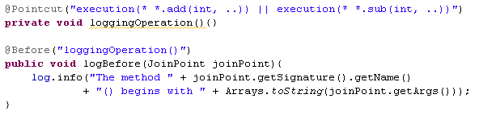

#### Aop使用

##### Aop使用步骤 --  基于注解模式

1. 在pom配置文件中，添加如下的maven

```xml
        <!--AOP引用aspectj对应的jar包，开始-->
        <dependency>
            <groupId>org.aspectj</groupId>
            <artifactId>aspectjrt</artifactId>
            <version>1.9.1</version>
        </dependency>
        <dependency>
            <groupId>org.aspectj</groupId>
            <artifactId>aspectjweaver</artifactId>
            <version>1.9.1</version>
        </dependency>
        <!--AOP引用aspectj对应的jar包，结束~~-->
```

2. 在spring的配置文件,加入aop命名空间

```xml
<?xml version="1.0" encoding="UTF-8"?>
<beans xmlns="http://www.springframework.org/schema/beans"
       xmlns:xsi="http://www.w3.org/2001/XMLSchema-instance"
       xmlns:aop="http://www.springframework.org/schema/aop"
       xmlns:context="http://www.springframework.org/schema/context"
       xsi:schemaLocation="http://www.springframework.org/schema/beans
       http://www.springframework.org/schema/beans/spring-beans.xsd
       http://www.springframework.org/schema/context
       http://www.springframework.org/schema/context/spring-context.xsd
       http://www.springframework.org/schema/aop
       http://www.springframework.org/schema/aop/spring-aop.xsd">
    <!--自动配置-->
    <context:component-scan base-package="com.cxx.aop.impl"></context:component-scan>

    <aop:aspectj-autoproxy></aop:aspectj-autoproxy>
</beans>
```


3. 把h横切关注点的代码抽象到切面的类中

   3.1 切面首先是一个IOC 的bean，即加入@Component 注解

   3.2 切面还需要加入@Aspect注解

```java
package com.cxx.aop.impl.aspect;
import com.cxx.aop.impl.ArithmeticCalculator;
import org.aspectj.lang.JoinPoint;
import org.aspectj.lang.annotation.Aspect;
import org.aspectj.lang.annotation.Before;
import org.springframework.stereotype.Component;
import java.util.Arrays;
/**
 * 计算器的日志切面
 */
// 把这个类声明为一个切面：需要把该类放入到IOC容器中，再声明为一个切面
@Aspect
@Component
public class CalculatorLoggingAspect {
    // 声明该方法是一个前置通知：在目标方法开始之前执行
    @Before("execution(* com.cxx.aop.impl.ArithmeticCalculator.*(..))")
    public void logBefore(JoinPoint joinPoint) {
        Object object = joinPoint.getTarget();
        String methodName = joinPoint.getSignature().getName();
        String methodArgs = Arrays.toString(joinPoint.getArgs());
        System.out.println("日志出输出-对象为："+object.getClass()+" 方法："+methodName+" 参数为："+methodArgs);
    }
}
```

基础类ArithmeticCalculator.java

```java
package com.cxx.aop.impl;
public interface ArithmeticCalculator {
    double add(int i, int j);
    double sub(int i, int j);
    double mul(int i, int j);
    double div(int i, int j);
}

```

实现类：ArithmeticCalculatorImpl.java

```java
package com.cxx.aop.impl;
import org.springframework.stereotype.Component;
@Component
public class ArithmeticCalculatorImpl implements ArithmeticCalculator {
    public double add(int i, int j) {
        int result = i+j;
        return result;
    }
    public double sub(int i, int j) {
        int result = i-j;
        return result;
    }
    public double mul(int i, int j) {
        int result = i*j;
        return result;
    }
    public double div(int i, int j) {
        int result = i/j;
        return result;
    }
}
```

调用：

```java
        ApplicationContext ctx = new ClassPathXmlApplicationContext("applicaionContext.xml");
        ArithmeticCalculator arithmeticCalculator =ctx.getBean(ArithmeticCalculator.class);

        double result = arithmeticCalculator.add(5,6);
        System.out.println(result);
         result = arithmeticCalculator.mul(4,6);
        System.out.println(result);
```

输出：

> 日志出输出-对象为：class com.cxx.aop.impl.ArithmeticCalculatorImpl 方法：add 参数为：[5, 6]
> 11.0
> 日志出输出-对象为：class com.cxx.aop.impl.ArithmeticCalculatorImpl 方法：mul 参数为：[4, 6]
> 24.0


##### 用AspectJ 注解声明切面

1. **要在 Spring 中声明 AspectJ 切面, 只需要在 IOC 容器中将切面声明为 Bean 实例.** 当在 Spring IOC 容器中初始化 AspectJ 切面之后, Spring IOC 容器就会为那些与 AspectJ 切面相匹配的 Bean 创建代理.
2. **在 AspectJ 注解中, 切面只是一个带有 @Aspect 注解的 Java 类.** 
3. **通知是标注有某种注解的简单的 Java 方法.**
4. AspectJ 支持 5 种类型的通知注解: 
   - @**Before**: 前置通知, 在方法执行之前执行
   - @**After**: 后置通知, 在方法执行之后执行 
   - @**AfterRunning**: 返回通知, 在方法返回结果之后执行
   - @**AfterThrowing**: 异常通知, 在方法抛出异常之后
   - @**Around**: 环绕通知, 围绕着方法执行


###### 利用**方法签名**编写 AspectJ 切入点表达式

1. 什么是切入点：

   由通知注解（eg：@**Before**）放置到方法前，表示的是切入点表达式

   例如：

   ```java
   @Before("execution(* com.cxx.aop.impl.ArithmeticCalculator.*(..))")
       public void logBefore(JoinPoint joinPoint) 
   ```

2. 什么是切入点表达式：**切点表达式表示执行任意类的任意方法**

   execution(* * . *(..))

   > 注释：
   >
   > **第一个 * 代表匹配任意修饰符及任意返回值,  第二个 * 代表任意类的对象,第三个 * 代表任意方法, 参数列表中的 ..  匹配任意数量的参数**

3. 最典型的切入点表达式时根据方法的签名来匹配各种方法:

   - execution * com.atguigu.spring.ArithmeticCalculator.*(..): 匹配 ArithmeticCalculator 中声明的所有方法,第一个 * 代表任意修饰符及任意返回值. 第二个 * 代表任意方法. .. 匹配任意数量的参数. 若目标类与接口与该切面在同一个包中, 可以省略包名.
   - execution public * ArithmeticCalculator.*(..): 匹配 ArithmeticCalculator 接口的所有公有方法.
   - execution public double ArithmeticCalculator.*(..): 匹配 ArithmeticCalculator 中返回 double 类型数值的方法
   - execution public double ArithmeticCalculator.*(double, ..): 匹配第一个参数为 double 类型的方法, .. 匹配任意数量任意类型的参数
   - execution public double ArithmeticCalculator.*(double, double): 匹配参数类型为 double, double 类型的方法.

4. 合并切入点表达式

   在 AspectJ 中, 切入点表达式可以通过操作符 &&, ||, ! 结合起来. 例如：

   


###### 让通知访问当前连接点的细节

可以在通知方法中声明一个类型为 JoinPoint 的参数. 然后就能访问链接细节. 如方法名称和参数值. 

```java
// 获取当前目标对象joinPoint.getTarget();
        Object object = joinPoint.getTarget();
//        ArithmeticCalculator arithmeticCalculator = (ArithmeticCalculator) joinPoint.getTarget();
//        System.out.println(arithmeticCalculator.div(10,8));

        // 获取方法名joinPoint.getSignature().getName()
        String methodName = joinPoint.getSignature().getName();
        // 获取参数joinPoint.getArgs()
        String methodArgs = Arrays.toString(joinPoint.getArgs());
```


##### @**Before**: 前置通知, 在方法执行之前执行

上面的实例便是使用Before进行前置通知某个方法执行前所要做的事情。

```java
// 声明该方法是一个前置通知：在目标方法开始之前执行
    @Before("execution(* com.cxx.aop.impl.ArithmeticCalculator.*(..))")
    public void logBefore(JoinPoint joinPoint) {
        Object object = joinPoint.getTarget();
        String methodName = joinPoint.getSignature().getName();
        String methodArgs = Arrays.toString(joinPoint.getArgs());
        System.out.println("日志出输出-对象为："+object.getClass()+" 方法："+methodName+" 参数为："+methodArgs);
    }
```


###### @**After**: 后置通知, 在方法执行之后执行

概念： 后置通知是在连接点完成之后执行的, 即**连接点返回结果或者抛出异常的时候, 下面的后置通知记录了方法的终止.** 

一个切面可以包括一个或者多个通知. --》 用 AspectJ 注解声明切面的切面类中可以有多个不同的@Before、@After、@AfterRunning、@AfterThrowing、@around等不同的通知

在CalculatorLoggingAspect.java 切面中配置

```
    // 后置通知：在目标方法执行后（无论是否发生异常），执行的通知
    // 在后置通知中还不能访问目标执行的结果
    @After("execution(* com.cxx.aop.impl.ArithmeticCalculator.*(..))")
    public void afterLog(JoinPoint joinPoint){
        // 获取方法名joinPoint.getSignature().getName()
        String methodName = joinPoint.getSignature().getName();
        // 获取参数joinPoint.getArgs()
        String methodArgs = Arrays.toString(joinPoint.getArgs());
        System.out.println("方法结束后 -- 日志输出-方法："+methodName+" 结束");
    }
```

调用：

```java
        ApplicationContext ctx = new ClassPathXmlApplicationContext("applicaionContext.xml");
        ArithmeticCalculator arithmeticCalculator =ctx.getBean(ArithmeticCalculator.class);

        double result = arithmeticCalculator.add(5,6);
        System.out.println(result);
         result = arithmeticCalculator.mul(4,6);
        System.out.println(result);
```

输出：

> 日志出输出-对象为：class com.cxx.aop.impl.ArithmeticCalculatorImpl 方法：add 参数为：[5, 6]
> 方法结束后 -- 日志输出-方法：add 结束
> 11.0
> 日志出输出-对象为：class com.cxx.aop.impl.ArithmeticCalculatorImpl 方法：mul 参数为：[4, 6]
> 方法结束后 -- 日志输出-方法：mul 结束
> 24.0