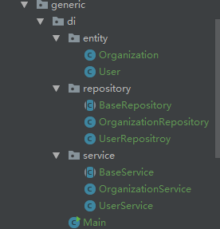
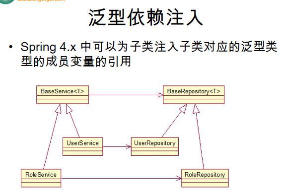

#####  15.泛型依赖注入

参考[url](https://www.cnblogs.com/solverpeng/p/5687304.html)：https://www.cnblogs.com/solverpeng/p/5687304.html

参考[url](https://blog.csdn.net/u010837612/article/details/45582043)：https://blog.csdn.net/u010837612/article/details/45582043

参考[url](http://jinnianshilongnian.iteye.com/blog/1989330): http://jinnianshilongnian.iteye.com/blog/1989330

泛型讲解[url](https://www.cnblogs.com/chyu/p/4630798.html):https://www.cnblogs.com/chyu/p/4630798.html

参考[url](https://www.cnblogs.com/jeremy-blog/p/4026795.html): https://www.cnblogs.com/jeremy-blog/p/4026795.html


实例：

代码结构图：



具体代码:

**实体类：**

Organization.java

```java
package com.cxx.generic.di.entity;
import java.io.Serializable;
public class Organization implements Serializable {
    private Long id;
    private String name;
}
```

User.java

```java
package com.cxx.generic.di.entity;
import java.io.Serializable;
public class User implements Serializable{
    private Long id;
    private String name;
}
```

**持久层类:**

持久层基类：BaseRepository.java

```java
package com.cxx.generic.di.repository;
import java.io.Serializable;
public abstract class BaseRepository<M extends Serializable> {
    public void save(M m) {
        System.out.println("=========repository save:"+m);
    }
}
```

其继承的类:OrganizationRepository.java

```java
package com.cxx.generic.di.repository;
import com.cxx.generic.di.entity.Organization;
import org.springframework.stereotype.Repository;
@Repository
public class OrganizationRepository extends BaseRepository<Organization> {
}
```

其继承的类:UserRepositroy.java

```java
package com.cxx.generic.di.repository;
import com.cxx.generic.di.entity.User;
import org.springframework.stereotype.Repository;
@Repository
public class UserRepositroy extends BaseRepository<User> {
}
```

**服务层类：**

服务层基类：BaseService.java

```java
package com.cxx.generic.di.service;
import com.cxx.generic.di.repository.BaseRepository;
import org.springframework.beans.factory.annotation.Autowired;
import java.io.Serializable;
public abstract class BaseService<M extends Serializable> {
    @Autowired
    protected BaseRepository<M> repository;
    public void add() {
        System.out.println("add....");
        System.out.println(repository);
    }
}
```

实现类：OrganizationService.java

```java
package com.cxx.generic.di.service;
import com.cxx.generic.di.entity.Organization;
import org.springframework.stereotype.Service;
@Service
public class OrganizationService extends BaseService<Organization> {
}
```

实现类：UserService.java

```java
package com.cxx.generic.di.service;
import com.cxx.generic.di.entity.User;
import org.springframework.stereotype.Service;
@Service
public class UserService extends BaseService<User> {
}
```

配置文件.xml

```xml
<?xml version="1.0" encoding="UTF-8"?>
<beans xmlns="http://www.springframework.org/schema/beans"
       xmlns:xsi="http://www.w3.org/2001/XMLSchema-instance"
       xmlns:context="http://www.springframework.org/schema/context"
       xsi:schemaLocation="http://www.springframework.org/schema/beans
       http://www.springframework.org/schema/beans/spring-beans.xsd
       http://www.springframework.org/schema/context
        http://www.springframework.org/schema/context/spring-context.xsd">

    <context:component-scan base-package="com.cxx.generic"></context:component-scan>
</beans>
```

调用：

```java
        ApplicationContext ctx = new ClassPathXmlApplicationContext("beans-generter.xml");
        BaseService service1 = (BaseService) ctx.getBean("userService");
        service1.add();

        BaseService service2 = (BaseService) ctx.getBean("organizationService");
        service2.add();
```

输出：

>add....
>com.cxx.generic.di.repository.**UserRepositroy**@1fc2b765
>add....
>com.cxx.generic.di.repository.**OrganizationRepository**@75881071
>
>从结果看，虽然子类没有建立依赖关系，但userRepository实例还是被实例化了，就证明了父类的依赖关系，子类是可以继承的
>
>其实这里也可以说明，就算父类不是被IOC容器管理，但是建立关系时添加了@Autowired注解，父类的关系会被继承下来

注解：

> 重点是在BaseService这个抽象类中：public abstract class ==**BaseService<M extends Serializable>**== 。
>
> 因为这个类的内部有一个这个一个属性：
>
> ```java
> @Autowired
> protected BaseRepository<M> repository;
> // 传递泛型进来后，将会注入该泛型的基类的子类。但是会根据泛型的类型进行匹配。
> eg：
>         BaseService service1 = (BaseService) ctx.getBean("userService");
> // 这里首先获取到的是UserService类的单例实例。然后进行根据是
> ```

**说明**：

> Spring 4.x 中可以为子类注入子类对应的泛型类型的成员变量的引用,（这样子类和子类对应的泛型类自动建立关系）



