# spring笔记


> 本笔记是观看尚硅谷的佟刚老师的《尚硅谷spring4》视频

## spring 基础理解

1. spring是什么：

> - 轻量级：Spring 是非侵入性的 - 基于 Spring 开发的应用中的对象可以不依赖于Spring 的 API
> - 依赖注入(DI --- dependency injection、IOC)
> - 面向切面编程(AOP --- aspect oriented programming)容器: Spring 是一个容器, 因为它包含并且管理应用对象的生命周期
> - 框架: Spring 实现了使用简单的组件配置组合成一个复杂的应用. 在 Spring 中可以使用 XML 和 Java 注解组合这些对象
> - 一站式：在 IOC 和 AOP 的基础上可以整合各种企业应用的开源框架和优秀的第三方类库 （实际上 Spring 自身也提供了展现层的 SpringMVC 和 持久层的 Spring JDBC）

### spring 模块

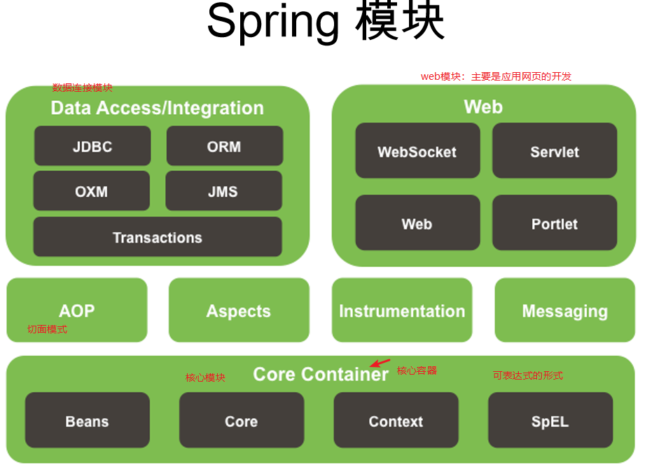


### spring 的IOC&DI概念

> - IOC(Inversion of Control)：其思想是**==反转资源获取的方向==**. 传统的资源查找方式要求组件向容器发起请求查找资源. 作为回应, 容器适时的返回资源. 而应用了 IOC 之后, 则是==**容器主动地将资源推送给它所管理的组件, 组件所要做的仅是选择一种合适的方式来接受资源.**== 这种行为也被称为查找的被动形式 =》类似于需要一个鸡蛋买回来放入篮子中，但是我把篮子放在门口（需要标注需要的东西），然后有人就会自动的把需要的鸡蛋（内容）放入到篮子中，这样便可以用这个鸡蛋了（内容）。
> - DI(Dependency Injection)— IOC 的另一种表述方式：==即组件以一些预先定义好的方式**(例如: setter 方法)**接受来自如容器的资源注入==. 相对于 IOC 而言，这种表述更直接

### IOC的前生

#### 1. 分离接口与实现

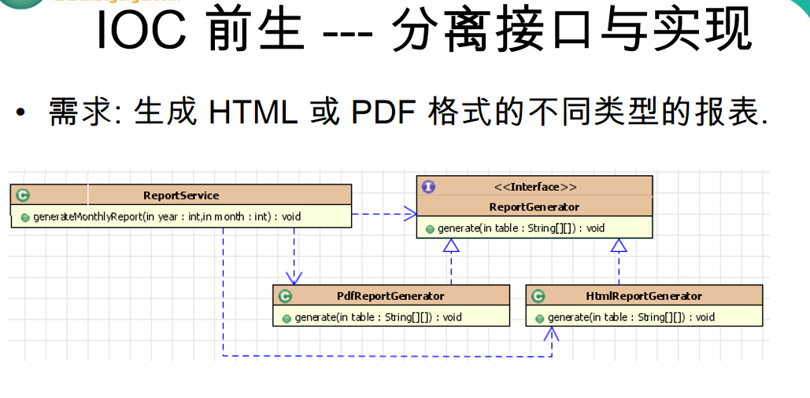

​	采用自己的语言描述：将报表用一接口定义（ReprotGenerator），pdf的报表生成器与html的报表生成器分别实现该报表生成器的接口，而报表服务层（ReportService）则用如下的方法进行调用-》从而实现说接口的分离。

```
ReportGenerator rg = new PdfReportGenerator();
ReportGenerator rg = new HtmlReportGenerator();
```


#### 2. 采用工厂模式

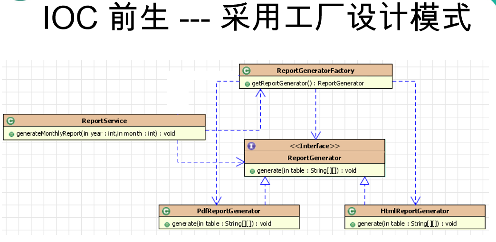

​	采用自己的语言简单描述：在分离接口基础上，由工厂（ReprotGeneratorFactory）去生成Report Generator对应的实现类，再在ReportService中进行调用

#### 3. 采用反转控制

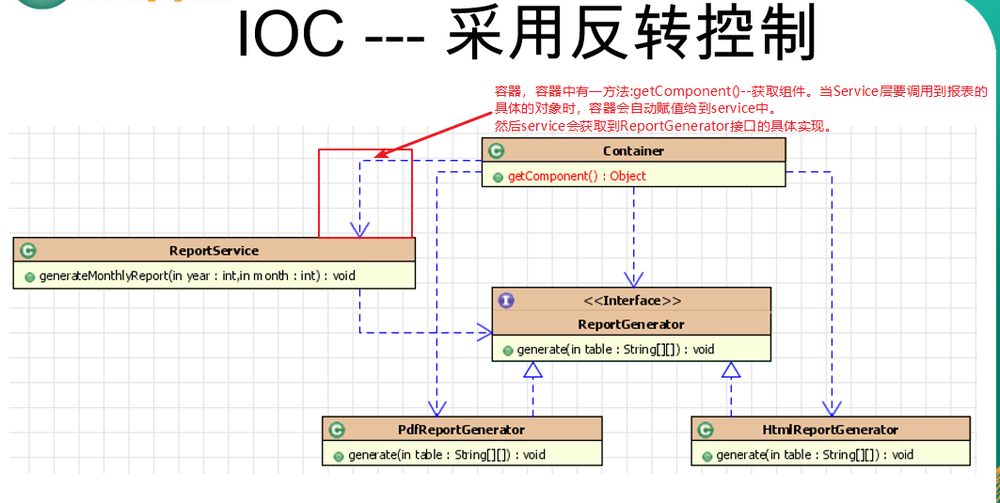


### IOC&DI概述

#### 配置 bean -- 重点

>- 配置形式：基于 XML 文件的方式；基于注解的方式
>- Bean 的配置方式：通过全类名（反射）、通过工厂方法（静态工厂方法 & 实例工厂方法）、FactoryBean
>- IOC 容器 BeanFactory & ApplicationContext 概述
>- 依赖注入的方式：属性注入；构造器注入
>- 注入属性值细节
>- 自动转配
>- bean 之间的关系：继承；依赖
>- bean 的作用域：singleton；prototype；WEB 环境作用域
>- 使用外部属性文件
>- spEL 
>- IOC 容器中 Bean 的生命周期
>- Spring 4.x 新特性：泛型依赖注入

结合具体例子：

​	背景：创建一个Service层的对象，然后将其配置到xml文件中（通过全类名-反射）。

1. 1 spring.xml文件 -- 放置在Classpath下

```xml
<?xml version="1.0" encoding="UTF-8"?>
<beans xmlns="http://www.springframework.org/schema/beans"
       xmlns:xsi="http://www.w3.org/2001/XMLSchema-instance"
       xsi:schemaLocation="http://www.springframework.org/schema/beans http://www.springframework.org/schema/beans/spring-beans.xsd">

    <bean id="fadacai" class="com.cxx.service.FDC" >
        <property name="fdc" value="一夜暴富"></property>
    </bean>

</beans>
```

1.2 Service层

```java
package com.cxx.service;

public class FDC {

    private String fdc;

    public String getFdc() {
        return fdc;
    }

    public void setFdc(String fdc) {
        this.fdc = fdc;
    }

    public void service() {
        System.out.println("成长-不可能一帆风顺-但不可放弃-努力吧-发大财！");
    }
}

```

1.3 Controller 调用

```java
package com.cxx.Controller;

import com.cxx.service.FDC;
import org.springframework.context.ApplicationContext;
import org.springframework.context.support.ClassPathXmlApplicationContext;

public class controller {

    public static void main(String[] args) {
        // 1. 创建Spring的IOC容器 ApplicationContext是一个接口
      	// ApplicationContext 代表IOC容器
      	// ClassPathXmlApplicationContext：是ApplicationContext的实现类，该实现类从类路径下加载的配置文件
        ApplicationContext ctx = new ClassPathXmlApplicationContext("spring.xml");

        // 2. 从容器中获取Bean对象
      	// 利用id定位到IOC容器中的bean
        FDC fdc = (FDC) ctx.getBean("fadacai");
		// 如果利用类型返回IOC容器中的Bean，但要求的是IOC容器中必须只能由一个该类型的Bean 如下
      	// FDC fdc = (FDC) ctx.getBean(FDC.class);
      
        // 3. 调用对象方法
        System.out.println(fdc.getFdc());
        fdc.service();

    }
}

```


##### 1. 在xml文件中配置

```xml
    <bean id="fadacai" class="com.cxx.service.FDC" > -- bean 通过全类名进行配置 
        <property name="fdc" value="一夜暴富"></property> -- name -- 是类中的setFdc()方法进行配置FDC属性的内容 -- 俗称赋值-》DI依赖注入的内容
    </bean>
```

>注释：
>
>-id：Bean的名称
>
>  - 在IOC容器是唯一的
>  - 若id没有指定，Spring自动将权限定性类名作为Bean的名字
>  - id可以指定多个名字，名字之间可用逗号、分号、空格分隔


##### 2. spring容器

​	在SpringIOC容器中读取Bean配置并创建Bean实例之前，必须要对Spring容器进行实例化如下：

```java
ApplicationContext ctx = new ClassPathXmlApplicationContext("spring.xml");
```

​	也就是说：只有在容器实例化后，才可以用IOC容器里获取Bean的实例并使用。

spring提供两种类型的IOC容器

- BeanFactory: IOC容器的基本实现
- ApplicationContext：提供了更多的高级特性。是BeanFactory的子接口

> BeanFactory 是Srping框架的基础设施，面向Spring本身；
>
> ApplicationContext：面向使用Spring框架的开发者，**几乎所有的应用场合都直接使用ApplicationContext而非底层的BeanFactory。**
>
> 无论使用何用方式，配置文件时是相同的。

ApplicationContext的实现关系：

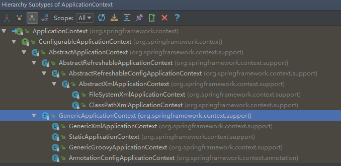

###### ApplicationContext内容

> 主要实现类：
>
> - **ClassPathXmlApplicationContext**：从 类路径下加载配置文件
> - FileSystemXmlApplicationContext: 从文件系统中加载配置文件

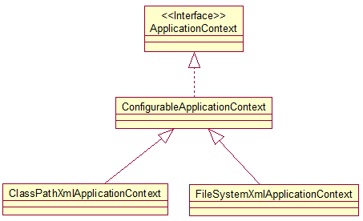

>由上图（上上图）可得：ClassPathxxx和FileSystemxxx最终是实现了ConfigurableApplicationContext接口，ConfigurableApplicationContext是继承了ApplicationContext接口的。
>
>ConfigurableApplicationContext 扩展于 ApplicationContext，新增加两个主要方法：refresh() 和 **close**()， 让 ApplicationContext 具有启动、刷新和关闭上下文的能力

> **ApplicationContext 在初始化上下文时就实例化所有单例的 Bean。**

> WebApplicationContext 是专门为 WEB 应用而准备的，它允许从相对于 WEB 根目录的路径中完成初始化工作

##### 3 从IOC容器中获取Bean

调用ApplicationContext的getBean()方法


##### 4. 依赖注入的方式 

###### 4.0 理解

这里的依赖注入我理解的是：类中的属性可以通过setter方式（属性注入）、以及通过构造器进行注入到该bean实例中

> - 属性注入
> - 构造器注入
> - 工厂方法注入（很少使用，不推荐）

###### 4.1 属性注入 -- 一定要有setter方法

```xml
   <bean id="fadacai" class="com.cxx.service.FDC" > -- bean 通过全类名进行配置 
        <property name="fdc" value="一夜暴富"></property> -- name -- 是类中的setFdc()方法进行配置FDC属性的内容 -- 俗称赋值-》DI依赖注入的内容
    </bean>
```

里面的<property>标识中，name里面的内容表示要注入的SetXXX方法（注意的是，使用的是驼峰标识）。value表示要赋入的值。

- 属性注入使用 <property> 元素, 使用 name 属性指定 Bean 的属性名称，value 属性或 <value> 子节点指定属性值 

>属性注入即通过 **setter** 方法注入Bean 的属性值或依赖的对象
>
>属性注入是实际应用中最常用的注入方式


###### 4.2 构造方法注入 -- 一定要有对应的构造器

使用的是<constructor-arg> -- 使用构造器注入属性值可以指定参数的位置和参数的类型（可混合使用）以区分重载的构造器！

【实例2】使用实例：背景-有一个Car类，在IOC容器中实例化后，进行注入。

Car.class

```java
package com.cxx.entity;

public class Car {
    private String company;
    private String brand;
    private int maxSpeed;
    private float price;

  // setter和getter方法()
    public Car(String company, String brand, int maxSpeed) {
        this.company = company;
        this.brand = brand;
        this.maxSpeed = maxSpeed;
    }
    public Car(String company, String brand, float price) {
        this.company = company;
        this.brand = brand;
        this.price = price;
    }
}

```

配置文件：按照索引来配置的。

```xml
    <bean id="car1" class="com.cxx.entity.Car">
        <constructor-arg value="jx" index="0"></constructor-arg>
        <constructor-arg value="bama" index="1"></constructor-arg>
        <constructor-arg value="120" index="2"></constructor-arg>
    </bean>


    <bean id="car2" class="com.cxx.entity.Car">
        <constructor-arg value="cxx" index="0"></constructor-arg>
        <constructor-arg value="fll" index="1"></constructor-arg>
        <constructor-arg value="5200.0" index="2"></constructor-arg>
    </bean>
```

调用：明明配置一个是整数、另外一个是浮点的，但是为什么都会配置到浮点型的属性中呢？所以上面的索引不太合适。

```java
        // 1. 创建Spring的IOC容器 ApplicationContext是一个接口
        ApplicationContext ctx = new ClassPathXmlApplicationContext("spring.xml");

        Car car1 = (Car) ctx.getBean("car1");
        System.out.println(car1);

        Car car2 = (Car) ctx.getBean("car2");
        System.out.println(car2);
```

输出：

>Car{company='jx', brand='bama', maxSpeed=0, **price=120.0**}
>Car{company='cxx', brand='fll', maxSpeed=0, **price=5200.0**}

--》 从而引出用构造器中配置**参数类型（区分重载的方法）** 

```xml
    <bean id="car1" class="com.cxx.entity.Car">
        <constructor-arg value="jx" type="java.lang.String"></constructor-arg>
        <constructor-arg value="bama" type="java.lang.String"></constructor-arg>
        <constructor-arg value="120" type="int"></constructor-arg>
    </bean>

    <bean id="car2" class="com.cxx.entity.Car">
        <constructor-arg value="cxx" type="java.lang.String"></constructor-arg>
        <constructor-arg value="fll" type="java.lang.String"></constructor-arg>
        <constructor-arg value="5200.0" type="float"></constructor-arg>
    </bean>
```

输出结果：

>Car{company='jx', brand='bama', **maxSpeed=120**, price=0.0}
>Car{company='cxx', brand='fll', maxSpeed=0, **price=5200.0**}


##### 5. 注入属性值细节

###### 5.1 使用字面值

>字面值：可用字符串表示的值，可以通过 <value> 元素标签或 value 属性进行注入。
>
>**基本数据类型及其封装类、String** 等类型都可以采取字面值注入的方式 -- 会自动转换，例如上方的value="5200.0"是String，转换为float
>
>若字面值中包含特殊字符，可以使用 **<![CDATA[]]>** 把字面值包裹起来。


###### 5.2 引用其他Bean

背景如【实例2】中，增加人这个class

```java
package com.cxx.entity;

public class Persion {
    private String name;
    private int age;
    private Car car ;
// getter和setter方法

    @Override
    public String toString() {
        return "Persion{" +
                "name='" + name + '\'' +
                ", age=" + age +
                ", car=" + car +
                '}';
    }
}

```

xml中配置

```xml
    <bean id="car1" class="com.cxx.entity.Car">
        <constructor-arg value="jx" type="java.lang.String"></constructor-arg>
        <constructor-arg value="bama" type="java.lang.String"></constructor-arg>
        <constructor-arg value="120" type="int"></constructor-arg>
    </bean>


    <bean id="car2" class="com.cxx.entity.Car">
        <constructor-arg value="cxx" type="java.lang.String"></constructor-arg>
        <constructor-arg value="fll" type="java.lang.String"></constructor-arg>
        <constructor-arg value="5200.0" type="float"></constructor-arg>
    </bean>

    <bean class="com.cxx.entity.Persion" id="persion">
        <property name="name" value="cxx"></property>
        <property name="age" value="18"></property>
        <!--可以使用property的ref属性建立bean之间的应用关系-->
        <property name="car" ref="car1"></property>
    </bean>
```

调用：

```java
      Persion persion = (Persion) ctx.getBean("persion");
        System.out.println(persion);
```

输入：

>Persion{name='cxx', age=18, car=Car{company='jx', brand='bama', maxSpeed=120, price=0.0}}

说明：

> - 组成应用程序的 Bean 经常需要相互协作以完成应用程序的功能. 要使 Bean 能够相互访问, 就必须在 Bean 配置文件中指定对 Bean 的引用
> - 在 Bean 的配置文件中, 可以通过 <ref> 元素或 ref  属性为 Bean 的属性或构造器参数指定对 Bean 的引用. 
> - 也可以在**属性或构造器里包含 Bean 的声明**, 这样的 Bean 称为**内部 Bean**

内部Bean的样例

```xml
    <bean class="com.cxx.entity.Persion" id="JX">
        <property name="name" value="JX"></property>
        <property name="age" value="18"></property>
        <!--可以使用使用内部bean，内部bean并不需要设置太多东西，只需要一个全类名就好。因为内部bean只会用于JX的这个实例中，并不会用于其他的实例上-->
        <property name="car">
            <bean class="com.cxx.entity.Car">
                <property name="company" value="Ford"/>
                <property name="brand" value="Changan"/>
                <property name="price" value="120000"/>
            </bean>
        </property>
    </bean>
```

调用：

```JAVA
        Persion JX = (Persion) ctx.getBean("JX");
        System.out.println(JX);
```

输出：

> Persion{name='JX', age=18, car=Car{company='Ford', brand='Changan', maxSpeed=0, price=120000.0}}

内部Bean的说明：

> - 当 Bean 实例仅仅给一个特定的属性使用时, 可以将其声明为内部 Bean. 内部 Bean 声明直接包含在 <property> 或 <constructor-arg> 元素里, **不需要设置任何 id 或 name 属性**
> - 内部 Bean 不能使用在任何其他地方

###### 5.3 注入参数详解：null 值和级联属性

null值

开启构造器

```java
    public Persion(String name, int age, Car car) {
        this.name = name;
        this.age = age;
        this.car = car;
    }

    public Persion() {
    }
```

配置文件：

```xml
    <bean class="com.cxx.entity.Persion" id="FDC">
        <constructor-arg value="FDC"></constructor-arg>
        <constructor-arg value="19"></constructor-arg>
        <constructor-arg ><null/></constructor-arg>
    </bean>
```


级联属性

> 和 Struts、Hiberante 等框架一样，Spring 支持级联属性的配置。

配置文件

```xml
    <bean class="com.cxx.entity.Persion" id="FDC">
        <constructor-arg value="FDC"></constructor-arg>
        <constructor-arg value="19"></constructor-arg>
        <constructor-arg ref="car1"></constructor-arg>
        <!--car里面的price属性必须得有setter方法。并且在car1这个实例中的这个属性都会修改为3000-->
        <!--为级联属性赋值 注意：属性需要先初始化后才可以为级联赋值，否会会有异常-->
        <property name="car.price" value="3000"></property>
    </bean>
```

调用：

```java
        Persion persion = (Persion) ctx.getBean("persion");
        System.out.println(persion);

        Persion JX = (Persion) ctx.getBean("JX");
        System.out.println(JX);

        Persion FDC = (Persion) ctx.getBean("FDC");
        System.out.println(FDC);
```

输出：

>Persion{name='cxx', age=18, car=Car{company='jx', brand='bama', maxSpeed=120, **price=3000.0**}}
>Persion{name='JX', age=18, car=Car{company='Ford', brand='Changan', maxSpeed=0, price=120000.0}}
>Persion{name='FDC', age=19, car=Car{company='jx', brand='bama', maxSpeed=120, **price=3000.0**}}


###### 5.4 集合属性

 5.4.1List实例

实体类：

```java
package com.cxx.entity.collection;
import com.cxx.entity.Car;
import java.util.List;
public class RichPersion {
    private String name;
    private int age;
    private List<Car> car ; // 主要是里的list对那个下方的list元素
	// setter和getter方法
}

```

配置文件：

```xml
    <!--测试集合属性-->
    <bean id="YK" class="com.cxx.entity.collection.RichPersion">
        <property name="name" value="YK"/>
        <property name="age" value="20"/>
        <property name="car">
            <!--使用list对应的list集合实行-->
            <list>
                <ref bean="car1"></ref>
                <ref bean="car2"/>
            </list>
        </property>
    </bean>
```

测试:

```java
  com.cxx.entity.collection.RichPersion YK = (com.cxx.entity.collection.RichPersion) ctx.getBean("YK");
        System.out.println(YK);
```

输出：

>Persion{name='YK', age=20, car=[Car{company='jx', brand='bama', maxSpeed=120, price=3000.0}, Car{company='cxx', brand='fll', maxSpeed=0, price=5200.0}]}

说明：

List和Set的说明

>- 在 Spring中可以通过一组内置的 xml 标签(例如: <list>, <set> 或 <map>) 来配置集合属性.
>- 配置 java.util.List 类型的属性, 需要指定 <list>  标签, 在标签里包含一些元素. 这些标签可以通过 <value> 指定简单的常量值, 通过 <ref> 指定对其他 Bean 的引用. 通过<bean> 指定内置 Bean 定义. 通过 <null/> 指定空元素. 甚至可以内嵌其他集合.
>- **数组的定义和 List 一样, 都使用 <list>**
>- 配置 java.util.Set 需要使用 <set> 标签, 定义元素的方法与 List 一样.

Map的说明

> - Java.util.Map 通过 <map> 标签定义, <map> 标签里可以使用多个 <entry> 作为子标签. 每个条目包含一个键和一个值. 
> - **必须在 <key> 标签里定义键**
> - 因为键和值的类型没有限制, 所以可以自由地为它们指定 <value>, <ref>, <bean> 或 <null> 元素. 
> - **可以将 Map 的键和值作为 <entry> 的属性定义: 简单常量使用 key 和 value 来定义; Bean 引用通过 key-ref 和 value-ref 属性定义**
> - 使用 <props> 定义 **java.util.Properties**, 该标签使用多个 <prop> 作为子标签. 每个 <prop> 标签必须定义 key 属性. 

5.4.2 Map的实例

1. 实体类

   ```java
   package com.cxx.entity.collection;

   import com.cxx.entity.Car;

   import java.util.List;
   import java.util.Map;

   public class MoreRichPersion {
       private String name;
       private int age;
       private Map<String,Car> car ;
   	// setter和getter
   }

   ```

   2.配置xml文件

   ```xml
       <!--测试Map集合-->
       <bean id="GDK" class="com.cxx.entity.collection.MoreRichPersion">
           <property name="name" value="XDD"/>
           <property name="age" value="19"/>
           <property name="car">
               <!--使用map 节点以及map的entry子节点配置Map类型的成员变量-->
               <map>
                   <entry key="AA" value-ref="car1"/>
                   <entry key="BB" value-ref="car2"/>
               </map>
           </property>
       </bean>
   ```

   测试：

   ```java
           MoreRichPersion MRP = (MoreRichPersion) ctx.getBean("GDK");
           System.out.println(MRP);
   ```

   输出：

   >Persion{name='XDD', age=19, car={AA=Car{company='jx', brand='bama', maxSpeed=120, price=3000.0}, BB=Car{company='cxx', brand='fll', maxSpeed=0, price=5200.0}}}

   ​

   5.4.3 Properties实例

   实体类：

   ```java
   package com.cxx.entity.collection;
   import java.util.Properties;
   public class DBProperties {
       private Properties properties;
    //setter与getter
   }
   ```

   配置文件：

   ```xml
       <!--测试PropetiesBean-->
       <bean id="properties" class="com.cxx.entity.collection.DBProperties">
           <property name="properties">
               <!--使用props和prop子节点为Properties属性赋值-->
               <props>
                   <prop key="user">user</prop>
                   <prop key="password">123</prop>
                   <prop key="jdbcUrl">jdbc:mysql:///test</prop>
                   <prop key="driverClass">com.mysql.jdbc.Driver</prop>
               </props>
           </property>
       </bean>
   ```

   调用：

   ```java
           DBProperties properties = (DBProperties) ctx.getBean("properties");
           System.out.println(properties);
   ```

   输出：

   >DBProperties{properties={driverClass=com.mysql.jdbc.Driver, user=user, password=123, jdbcUrl=jdbc:mysql:///test}}

   ​

   ###### 5.5 使用 utility scheme 定义集合

   一句话：配置单例的集合bean，供多个bean进行应用

   > - 缘由：使用基本的集合标签定义集合时, 不能将集合作为独立的 Bean 定义, 导致其他 Bean 无法引用该集合, 所以无法在不同 Bean 之间共享集合.
   > - 解决方案：可以使用 util schema 里的集合标签定义独立的集合 Bean. 需要注意的是, 必须在 <beans> 根元素里添加 util schema 定义

   实例：

   配置文件xml

   注意头:

   > <beans xmlns="http://www.springframework.org/schema/beans"       xmlns:xsi="http://www.w3.org/2001/XMLSchema-instance"        **xmlns:util="http://www.springframework.org/schema/util"**       xsi:schemaLocation="http://www.springframework.org/schema/beans http://www.springframework.org/schema/beans/spring-beans.xsd  http://www.springframework.org/schema/util  http://www.springframework.org/schema/util/spring-util-4.0.xsd ">

   ```xml
       <!--配置单例的集合bean，以供多个bean进行引用，需要导入util命名空间，在idea中打出<util:后Alt+Enter便可自动导入了-->
       <util:list id = "cars">
           <ref bean="car1"/>
           <ref bean="car2"/>
       </util:list>

       <bean class="com.cxx.entity.collection.RichPersion" id="rp">
           <property name="name" value="YK"/>
           <property name="age" value="20"/>
           <property name="car" ref="cars"></property>
       </bean>
   ```

   调用：

   ```java
           RichPersion rp = (RichPersion) ctx.getBean("rp");
           System.out.println(rp);
   ```

   输出：

   >Persion{name='rp', age=20, car=[Car{company='jx', brand='bama', maxSpeed=120, price=3000.0}, Car{company='cxx', brand='fll', maxSpeed=0, price=5200.0}]}

   ​


###### 5.5 p命名空间配置bean属性

1.引入p命名空间

```xml
 xmlns:p="http://www.springframework.org/schema/p"
```

2.利用前面java类，配置到xml文件中：

```xml
 <!--配置单例的集合bean，以供多个bean进行引用，需要导入util命名空间，在idea中打出<util:后Alt+Enter便可自动导入了-->    
<util:list id = "cars">
        <ref bean="car1"/>
        <ref bean="car2"/>
    </util:list>
<!--通过p命名空间为bean的属性赋值，需要先导入p命名空间，相对于传统的配置方式更加的简洁-->
    <bean id="YZ" class="com.cxx.entity.collection.RichPersion" p:age="18" p:name="richPersion" p:car-ref="cars"></bean>

```

调用：

```java
        RichPersion qian = (RichPersion) ctx.getBean("YZ");
        System.out.println(qian);
```

结果：

> Persion{name='richPersion', age=18, car=[Car{company='jx', brand='bama', maxSpeed=120, price=3000.0}, Car{company='cxx', brand='fll', maxSpeed=0, price=5200.0}]}

一句话总结：P命名空间是在bean中配置封装的类的属性值的。


##### 6. XML配置 -- bean自动专配

1.正常例子

重新配置新的java类:

```java
package com.cxx.autowire;

public class Car {
    private String company;
    private String brand;
    private int maxSpeed;
    private float price;
	// setter和getter方法
}

```

```java
package com.cxx.autowire;

public class Address {

    private String city;
    private String street;
//setter和getter方法
}

```

```java
package com.cxx.autowire;

public class Persion {
    private String name;
    private Car car ;
    private Address address;
	// setter和getter方法
}

```

配置文件：xml

```xml
<?xml version="1.0" encoding="UTF-8"?>
<beans xmlns="http://www.springframework.org/schema/beans"
       xmlns:xsi="http://www.w3.org/2001/XMLSchema-instance"
       xmlns:p="http://www.springframework.org/schema/p"
       xsi:schemaLocation="http://www.springframework.org/schema/beans http://www.springframework.org/schema/beans/spring-beans.xsd">

    <bean class="com.cxx.autowire.Car" id="car" p:company="jx" p:brand="bm" p:price="100000000" ></bean>
    <bean class="com.cxx.autowire.Address" id="address" p:city="gz" p:street="mt"></bean>

    <!--可以使用autowire属性指定自动装配的方式，byName 根据bean的名字（id）和当前的setter 风格的属性名进行自动装配。若有匹配的，则进行自动装配，如果没有匹配的。则不装配
        例如下方的例子：Rersion中有两个属性car、address。有两个封装方法setterCar,setterAddress.
        那么自动装配根据Name来话，上面刚好有个id为car的bean，以及id为address的bean。则可以配置到id为jx的Persionbean中
    -->
    <bean class="com.cxx.autowire.Persion" id="jx" autowire="byName" p:name="jx"></bean>

</beans>
```

调用：

```java
 ApplicationContext ctx = new ClassPathXmlApplicationContext("autowire-bean.xml");
        Persion persion = (Persion) ctx.getBean("jx");
        System.out.println(persion);
```

输出；

>Persion{name='jx', car=Car{company='jx', brand='bm', maxSpeed=0, price=1.0E8}, address=Address{city='gz', street='mt'}}


2.反例

xml配置文件：

```xml
    <bean class="com.cxx.autowire.Car" id="car1" p:company="jx" p:brand="bm" p:price="100000000" ></bean>
    <bean class="com.cxx.autowire.Address" id="address2" p:city="gz" p:street="mt"></bean>

    <!--可以使用autowire属性指定自动装配的方式，byName 根据bean的名字（id）和当前的setter 风格的属性名进行自动装配

	反例：上面的id为car1的bean实体并不符合Persion中的setterCar 风格的属性，则自动装配失败。同理address2一样
    -->
    <bean class="com.cxx.autowire.Persion" id="jx" autowire="byName" p:name="jx"></bean>
```

输出：

>Persion{name='jx', car=null, address=null}

说明：

>Spring IOC 容器可以自动装配 Bean. 需要做的仅仅是在 <bean> 的 autowire 属性里指定自动装配的模式
>
>装配的类型：
>
>- byTpe（根据类型自动装配）--缺点：若IOC容器中有1个以上的而类型匹配的bean，则抛异常
>- byName (根据名称自动装配)-**必须将目标 Bean 的名称和属性名设置的完全相同.**
>- constructor(通过构造器自动装配): 当 Bean 中存在多个构造器时, 此种自动装配方式将会很复杂. 不推荐使用

缺点：

> - 在 Bean 配置文件里设置 autowire 属性进行自动装配将会装配 Bean 的所有属性. 然而, 若只希望装配个别属性时, autowire 属性就不够灵活了.
> - autowire 属性要么根据类型自动装配, 要么根据名称自动装配, **不能两者兼而有之.**
> - 一般情况下，在实际的项目中很少使用自动装配功能，因为和自动装配功能所带来的好处比起来，明确清晰的配置文档更有说服力一些


##### 7. bean之间的关系 -- 继承；依赖

继承是**配置**上的继承

实例：

```xml
   		<!--现在这个bean是可以实例化的。因为没有设置abstract为true-->
		<bean id="address" class="com.cxx.autowire.Address" p:city="GZ1" p:street="beijinglu"/>
		
         <!--bean 配置继承：使用bean 的parent 属性指定继承哪个bean的配置-->
		<!--下面的street会覆盖上方的父bean-->
        <bean id="address2" parent="address"  p:street="baiyunshan"  />
```

调用：

```java
        ApplicationContext ctx = new ClassPathXmlApplicationContext("beans-relation.xml");
        Address address = (Address) ctx.getBean("address");
        System.out.println(address);

        Address address2 = (Address) ctx.getBean("address2");
        System.out.println(address2);
```

输出：

> Address{city='GZ1', street='beijinglu'}
> Address{city='GZ1', street='baiyunshan'}

说明：

>- **Spring 允许继承 bean 的配置,** 被继承的 bean 称为父 bean. 继承这个父 Bean 的 Bean 称为子 Bean
>- **子 Bean 从父 Bean 中继承配置, 包括 Bean 的属性配置**
>- 子 Bean 也可以覆盖从父 Bean 继承过来的配置
>- 父 Bean 可以作为配置模板, 也可以作为 Bean 实例. **若只想把父 Bean 作为模板, 可以设置 <bean> 的abstract 属性为 true**, 这样 Spring 将**不会实例化**这个 Bean
>- 并**不是 <bean> 元素里的所有属性都会被继承**. 比如: autowire, abstract 等
>- 也**可以忽略父 Bean 的 class 属性**, 让子 Bean 指定自己的类, 而共享相同的属性配置. 但此时 abstract 必须设为 true


- 父 Bean 可以作为配置模板, 也可以作为 Bean 实例. **若只想把父 Bean 作为模板, 可以设置 <bean> 的abstract 属性为 true**, 这样 Spring 将**不会实例化**这个 Bean

案例：

xml配置：

```xml
    <!--抽象bean： bean 的abstract 属性为true的备案。这样的bean 不能被 IOC 容器实例化，只能用来实例化 -->    
	<bean id="address" class="com.cxx.autowire.Address" p:city="GZ1" p:street="beijinglu" abstract="true"/>

        <!--bean 配置继承：使用bean 的parent 属性指定继承哪个bean的配置-->
        <bean id="address2" parent="address"  p:street="baiyunshan"  />
```

调用：

```java
        ApplicationContext ctx = new ClassPathXmlApplicationContext("beans-relation.xml");
        Address address = (Address) ctx.getBean("address");
        System.out.println(address);

        Address address2 = (Address) ctx.getBean("address2");
        System.out.println(address2);
```

输出：

Exception in thread "main" org.springframework.beans.factory.BeanIsAbstractException: Error creating bean with name **'address': Bean definition is abstract**

	at org.springframework.beans.factory.support.AbstractBeanFactory.checkMergedBeanDefinition(AbstractBeanFactory.java:1327)
	at org.springframework.beans.factory.support.AbstractBeanFactory.doGetBean(AbstractBeanFactory.java:285)
	at org.springframework.beans.factory.support.AbstractBeanFactory.getBean(AbstractBeanFactory.java:197)
	at org.springframework.context.support.AbstractApplicationContext.getBean(AbstractApplicationContext.java:1080)
	at com.cxx.autowire.test.main(test.java:10)


- 也**可以忽略父 Bean 的 class 属性**, 让子 Bean 指定自己的类, 而共享相同的属性配置. 但此时 abstract 必须设为 true

实例：

xml配置文件：

```xml
        <!--若一个bean的class属性没有指定，则该bean必须是一个抽象bean-->
        <bean id="address"  p:city="GZ1" p:street="beijinglu" abstract="true"/>

        <!--bean 配置继承：使用bean 的parent 属性指定继承哪个bean的配置-->
        <bean id="address2" class="com.cxx.autowire.Address" parent="address" p:street="baiyunshan"  />
```


依赖：

说明：

> - **Spring 允许用户通过 depends-on 属性设定 Bean 前置依赖的Bean**，前置依赖的 Bean 会在本 Bean 实例化之前创建好
> - 如果前置依赖于多个 Bean，则可以通**过逗号，空格或的方式**配置 Bean 的名称

实例：

xml配置

```xml
<?xml version="1.0" encoding="UTF-8"?>
<beans xmlns="http://www.springframework.org/schema/beans"
       xmlns:xsi="http://www.w3.org/2001/XMLSchema-instance"
       xmlns:p="http://www.springframework.org/schema/p"
       xsi:schemaLocation="http://www.springframework.org/schema/beans http://www.springframework.org/schema/beans/spring-beans.xsd">

        <!--若一个bean的class属性没有指定，则该bean必须是一个抽象bean-->
        <bean id="address"  p:city="GZ1" p:street="beijinglu" abstract="true"/>

        <!--bean 配置继承：使用bean 的parent 属性指定继承哪个bean的配置-->
        <bean id="address2" class="com.cxx.autowire.Address" parent="address" p:street="baiyunshan"  />

        <bean class="com.cxx.autowire.Car" id="car" p:company="cxx" p:brand="fll" p:price="10000000" p:maxSpeed="5000" />

        <!--要求在配置Persion时，必须有一个关联的car 换句话说persion 这个bean 依赖于Car这个bean
            实验结果：虽然Persion中有一个car属性，但是依赖一个car 的bean 的时候并不会将bean注入到属性car中。
            所以结果时car=null。依赖表明的说，我会依赖你。但是不一定说以来后就会有结果。
        -->
        <bean id="persion" class="com.cxx.autowire.Persion" p:name="cxx" p:address-ref="address2" depends-on="car"/>

</beans>
```

调用：

```java
        ApplicationContext ctx = new ClassPathXmlApplicationContext("beans-relation.xml");

        Car car = (Car) ctx.getBean("car");
        System.out.println(car);

        Persion persion = (Persion) ctx.getBean("persion");
        System.out.println(persion);
```

输出：

> Car{company='cxx', brand='fll', maxSpeed=5000, price=1.0E7}
>
> Persion{name='cxx', car=null, address=Address{city='GZ1', street='baiyunshan'}}


##### 8. bean的作用域：singleton；prototype；WEB 环境作用域

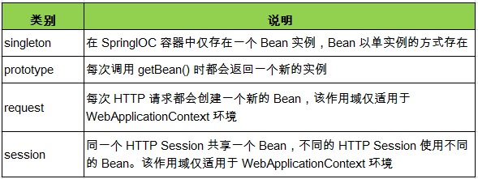

###### 8.1 singleton

==**默认情况下，在IOC容器中配置一个bean。这个bean是单例的singleton.**==

bean的作用域是singleton，在创建IOC容器的时候，bean会自动创建（注意：构造器无或者无参）

实例：

car.java

```java
    public Car() {
        System.out.println("Car Constructor...");
    }
```


xml配置文件：

```xml
    <!--
        使用bean 的scope 属性来配置bean的作用域
        singleton：默认值，容器初始化时创建bean 实例，在整个容器的生命周期内只创建者一个bean。 单例的
        prototype: 原型的。 容器初始化时不创建bean的实例，在每次请求时都拆个那就一个新的Bean实例，并返回。
    -->
    <bean id="car" class="com.cxx.autowire.Car"  scope="singleton">
        <property name="company" value="cxx" />
        <property name="brand" value="xian" />
        <property name="price" value="500000"/>
    </bean>
```

调用：

```java
        ApplicationContext ctx = new ClassPathXmlApplicationContext("beans-scope.xml");

        Car car = (Car) ctx.getBean("car");
        System.out.println(car);

        Car car1 = (Car) ctx.getBean("car");
        System.out.println(car1);
```

输出：

Car Constructor...  这一句话是在：ApplicationContext ctx = new ClassPathXmlApplicationContext("beans-scope.xml"); 这句话的时候产生的。因为创建IOC容器时，会将单例的bean自动的创建实例。

>Car Constructor... 
>Car{company='cxx', brand='xian', maxSpeed=0, price=500000.0}
>Car{company='cxx', brand='xian', maxSpeed=0, price=500000.0}


###### 8.2 prototype

实例：

xml文件:

```xml
    <!--
        使用bean 的scope 属性来配置bean的作用域
        singleton：默认值，容器初始化时创建bean 实例，在整个容器的生命周期内只创建者一个bean。 单例的
        prototype: 原型的。 容器初始化时不创建bean的实例，在每次请求时都拆个那就一个新的Bean实例，并返回。
    -->
    <bean id="car" class="com.cxx.autowire.Car"  scope="prototype">
        <property name="company" value="cxx" />
        <property name="brand" value="xian" />
        <property name="price" value="500000"/>
    </bean>
```

调用：

```java
        ApplicationContext ctx = new ClassPathXmlApplicationContext("beans-scope.xml");

        Car car = (Car) ctx.getBean("car");
        System.out.println(car);

        Car car1 = (Car) ctx.getBean("car");
        System.out.println(car1);
```

输出：

>Car Constructor...
>Car{company='cxx', brand='xian', maxSpeed=0, price=500000.0}
>Car Constructor...
>Car{company='cxx', brand='xian', maxSpeed=0, price=500000.0}


##### 9. 使用外部属性文件

> 缘由：某些配置文件不太适合集成到spring.xml文件中（否则要改动的时候操作spring配置文件不太合适了）。所以将其放置为外部属性文件，倒是spring可以引用即可
>
> 案例：
>
> - 文件路径
> - 数据源配置

说明：

> - 在配置文件里配置 Bean 时, 有时需要在 Bean 的配置里混入**系统部署的细节信息(例如: 文件路径, 数据源配置信息等).** 而这些部署细节实际上需要和 Bean 配置相分离
> - Spring 提供了一个 PropertyPlaceholderConfigurer 的 **BeanFactory 后置处理器**, 这个处理器允许用户将 Bean 配置的部分内容外移到**属性文件**中. 可以在 Bean 配置文件里使用形式为 **${var}** 的变量, PropertyPlaceholderConfigurer 从属性文件里加载属性, 并使用这些属性来替换变量.
> - Spring 还允许在属性文件中使用 ${propName}，以实现属性之间的相互引用。

###### 9.1 以数据源配置为例

1.引入C3P0的数据池、以及mysql的jar包

2.配置数据源属性文件(建议放置在类路径下)：

```properties
user=root
password=123456
driverclass=com.mysql.jdbc.Driver
jdbcurl=jdbc:mysql:///test
```

3.xml引用属性文件内容

```xml
<?xml version="1.0" encoding="UTF-8"?>
<beans xmlns="http://www.springframework.org/schema/beans"
       xmlns:xsi="http://www.w3.org/2001/XMLSchema-instance"

       xmlns:context="http://www.springframework.org/schema/context"
       xsi:schemaLocation="http://www.springframework.org/schema/beans http://www.springframework.org/schema/beans/spring-beans.xsd">

        <!--要引用一句话：xmlns:context="http://www.springframework.org/schema/context"-->
        <!--导入属性文件-->
        <context:property-placeholder location="classpath:mydb.properties"/>

        <bean id="dataSource" class="com.mchange.v2.c3p0.ComboPooledDataSource" >
                <!--使用外部化属性文件的属性-->
                <property name="user" value="${user}" ></property>
                <property name="password" value="${password}"></property>
                <property name="driverClass" value="${driverclass}"/>
                <property name="jdbcUrl" value="${jdbcurl}"/>
        </bean>

</beans>
```


##### 10 SpEL

> SpEL == Spring表达式语言（简称SpEL）
>
> 是一个**支持运行时查询和操作对象图的强大的表达式语言。**

>- 语法类似于 EL：SpEL 使用 **#{…}** 作为定界符，所有在大框号中的字符都将被认为是 SpEL
>- SpEL 为 bean 的属性进行**动态赋值**提供了便利
>- 通过 SpEL 可以实现：
>  - 通过 bean 的 id 对 bean 进行引用
>  - 调用方法以及引用对象中的属性
>  - 计算表达式的值
>  - 正则表达式的匹配

实例：

java类

```java
package com.cxx.spel;
public class Address {
    private String city;
    private String street;
  	// setter和getter方法
}
```

```java
package com.cxx.spel;
public class Car {
    private String brand;
    private float price;
    private float typePerimeter; // 轮胎半径
	// setter和getter方法
}
```

```java
package com.cxx.spel;

public class Persion {
    private String name;
    // 应用其他数据
    private Car car ;
    // 引用其他bean中的属性值
    private String city;
    // 引用sple运算符
    private String info;
  
  	// setter和getter方法
}
```

xml配置文件

```xml
<bean id="address" class="com.cxx.spel.Address">
        <!--使用SeEL 使用字面量-->
        <property name="city" value="#{'GZ'}"/>
        <property name="street" value="庙头" />
    </bean>
    <bean id="car" class="com.cxx.spel.Car" >
        <property name="brand" value="Audi"/>
        <property name="price" value="3000000"/>
        <!--使用SpEL 引用类的静态属性-->
        <property name="typePerimeter" value="#{T(java.lang.Math).PI*80}"></property>
    </bean>
    <bean id="person" class="com.cxx.spel.Persion" >
        <!--使用SpEL 来引用其他的bean-->
        <property name="car" value="#{car}"/>

        <!--使用SpEL 来引用其他的Bean的属性-->
        <property name="city" value="#{address.city}" />

        <!--使用SpEL 中使用运算符-->
        <property name="info" value="#{car.price >= 300000 ? '金领' : '白领'} "/>

        <property name="name" value="cxx" />
    </bean>
```

调用：

```java
  ApplicationContext ctx = new ClassPathXmlApplicationContext("bean-spel.xml");

        Address address = (Address) ctx.getBean("address");
        System.out.println(address);

        Car car = (Car) ctx.getBean("car");
        System.out.println(car);

        Persion persion = (Persion) ctx.getBean("person");
        System.out.println(persion);
```

输出结果：

>Address{city='GZ', street='庙头'}
>Car{brand='Audi', price=3000000.0, typePerimeter=251.32741}
>Persion{name='cxx', car=Car{brand='Audi', price=3000000.0, typePerimeter=251.32741}, city='GZ', info='金领'}

使用方式：

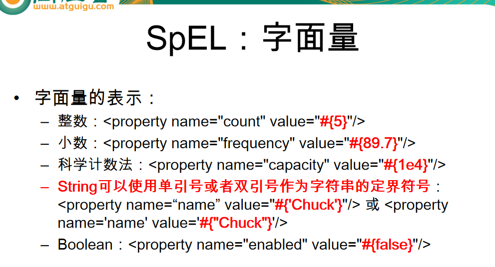

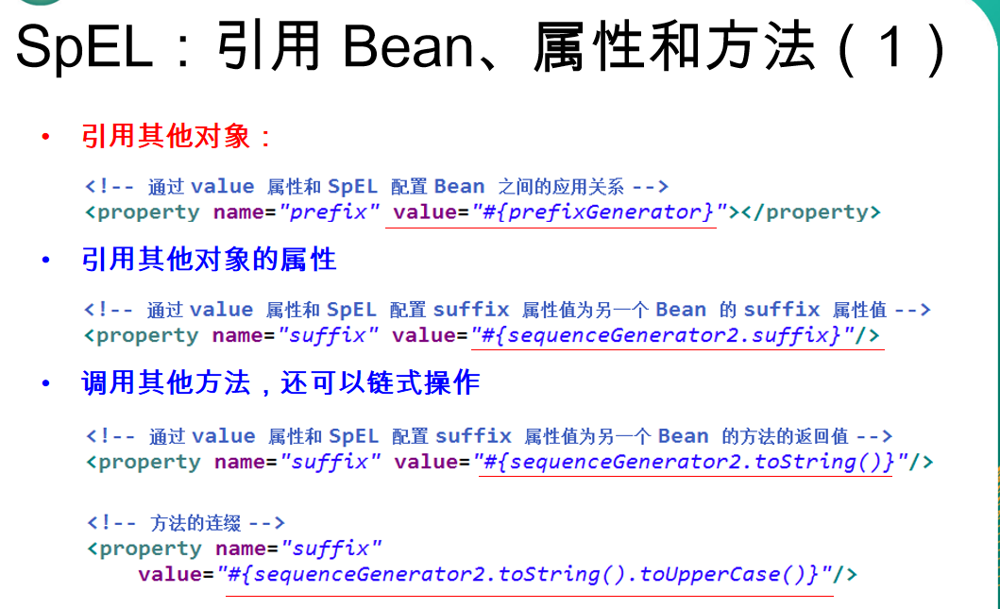

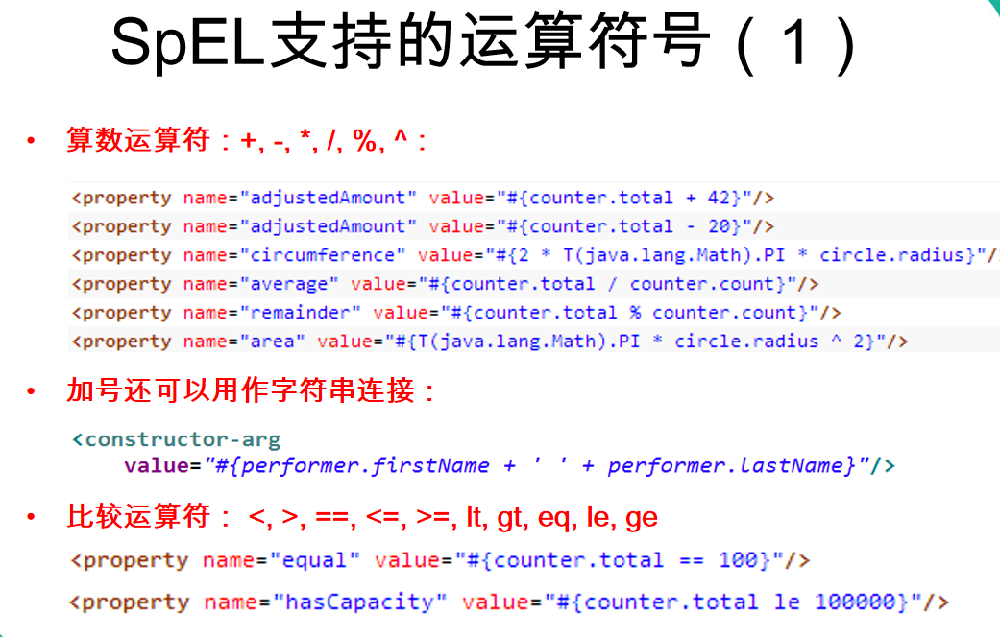

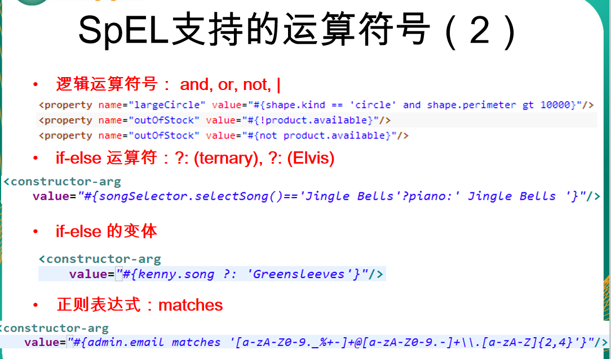

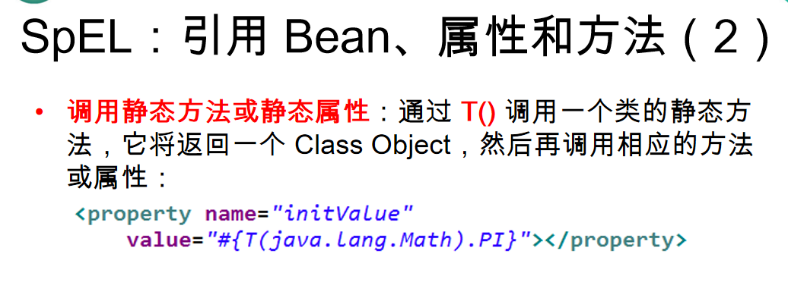


##### 11. IOC容器Bean的生命周期

######1.Bean的生命周期方法

> + Spring IOC 容器可以管理 Bean 的生命周期, Spring 允许在 Bean 生命周期的特定点执行定制的任务. 
> + **Spring IOC 容器对 Bean 的生命周期进行管理的过程:**
>   1. 过构造器或工厂方法创建 Bean 实例
>   2. 为 Bean 的属性设置值和对其他 Bean 的引用
>   3. **==调用 Bean 的初始化方法==**
>   4. Bean 可以使用了
>   5. 当容器关闭时, 调用 Bean 的销毁方法

> 在 Bean 的声明里设置 init-method 和 destroy-method 属性, 为 Bean 指定初始化和销毁方法.


实例：

java类

```java
package com.cxx.cycle;
public class Car {
    public Car() {
        System.out.println("Car's Constructor....");
    }
    private String brand;
    public void setBrand(String brand) {
      	System.out.println("setBrand...");
        this.brand = brand;
    }
    public void initCar() {
        System.out.println("Car init...");
    }
    public void destroyCar() {
        System.out.println("Car destroy...");
    }
}
```

xml配置

```xml
    <!--
        init-method="initCar" destroy-method="destroyCar" 表示的是，容器在创建的时候，会自动创建id为car的bean（反射，构造器创建/因为是单例模式，所以能否自动传教），
        由于设置了init-method的方法是Car类中的某一个方法，则在创建bean时调用该方法。
        destroy-method设置的方法时在容器关闭时所用到的。
      -->
    <bean id="car" class="com.cxx.cycle.Car" init-method="initCar" destroy-method="destroyCar">
        <property name="brand" value="Audi"/>
    </bean>
```

调用：

```java
        ClassPathXmlApplicationContext ctx = new ClassPathXmlApplicationContext("beans-cycle.xml");
        Car car = (Car) ctx.getBean("car");
        System.out.println(car);
        // 关闭IOC容器
        ctx.close();
```

结果：

>// 加载xml文件（spring的xml配置文件）将反射Car的构造器创建出Car的bean，然后会调用属性的setter方法赋值（在bean中有配置brand的属性赋值）。最后调用init-method（初始化方法）中写着的Car里面的方法。 -- 有下方可得：是创建完对象后再调用初始化方法得。
>
>信息: $Loading$ XML bean definitions from class path resource [beans-cycle.xml]
>**Car's Constructor....**
>**setBrand...**
>**Car init...**
>**Car{brand='Audi'}**
>**Car destroy...**
>九月 08, 2018 3:32:49 下午 org.springframework.context.support.ClassPathXmlApplicationContext $doClose$
>
>// IOC容器在关闭的时候，会自动调用destroy-method里面的方法（这个方法时类中的的一个方法）


######2.创建Bean后置处理器

> 自己的语言描述：
>
> Bean后置处理器需要实现BeanPostProcessor这个接口，然后在spring的配置文件中进行配置上去。【提示的是，自己的后置处理器在xml文件中并不需要配置id】
>
> 提示：
>
> 1. 可以有多个自己的后置处理器配置到spring的配置文件中。
> 2. bean的后置处理器都会对自己配置在xml文件中的bean实例逐一处理。**其典型应用是: 检查 Bean 属性的正确性或根据特定的标准更改 Bean 的属性.**

利用上方的Car类

增加多一个Address.class

```java
package com.cxx.cycle;

public class Address {

    private String street;

    public void setStreet(String street) {
        this.street = street;
    }

    public Address() {
        System.out.println("Address's 构造器");
    }

    @Override
    public String toString() {
        return "Address{" +
                "street='" + street + '\'' +
                '}';
    }

    public void addressInit() {
        System.out.println("Address中得方法addressInit被调用了");
    }

    public void addressDestroy() {
        System.out.println("Address中的方法addressDestroy被调用了");
    }
}

```

创建自己的bean后置处理器：

```java
package com.cxx.cycle;

import org.springframework.beans.BeansException;
import org.springframework.beans.factory.config.BeanPostProcessor;

public class MyBeanPostProcessor implements BeanPostProcessor {
    public Object postProcessBeforeInitialization(Object o, String s) throws BeansException {
        System.out.println("自己设置的后置处理器中postProcessBeforeInitialization()方法生效【在初始化方法 前 起作用】了：传输的bean对象为：" + o+"\tbean对象id（名称）为：" + s);
        if (o instanceof Car) {
            System.out.println("后置处理器中现在接收到的对象是Car类的实例，则可以进行对其操作处理（例如顶替、更换等操作，不知道删除可不可以）");
        }
        return o;
    }

    public Object postProcessAfterInitialization(Object o, String s) throws BeansException {
        System.out.println("自己设置的后置处理器中postProcessAfterInitialization()方法生效【在初始化方法 后 起作用】了：传输的bean对象为：" + o+"\tbean对象id（名称）为：" + s);
        return o;
    }
}

```


xml配置文件：

```xml

    <!--
        init-method="initCar" destroy-method="destroyCar" 表示的是，容器在创建的时候，会自动创建id为car的bean（反射，构造器创建/因为是单例模式，所以能否自动传教），
        由于设置了init-method的方法是Car类中的某一个方法，则在创建bean时调用该方法。
        destroy-method设置的方法时在容器关闭时所用到的。
      -->
    <bean id="car" class="com.cxx.cycle.Car" init-method="initCar" destroy-method="destroyCar">
        <property name="brand" value="Audi"/>
    </bean>

    <bean id="address" class="com.cxx.cycle.Address" init-method="addressInit" destroy-method="addressDestroy" >
        <property name="street" value="龙蟠里"/>
    </bean>

    <!--
        实现BeanPostProcessor 接口，并具体提供
        Object postProcessBeforeInitialization(Object o, String s) ：init-method 之 前 被调用
        Object postProcessAfterInitialization(Object o, String s)： init-method 指 后 被调用
        的实现

        o: bean 实例本身
        s: IOC 容器配置的bean的名字
        返回值：是实际上返回给用户的那个Bean，注意：可以在以上两个方法中修改返回的Bean，甚至返回一个新的bean
    -->
    <!--配置bean 的后置处理器：不需要配置id， IOC 容器自动识别是一个 实现BeanPostProcessor-->
    <bean class="com.cxx.cycle.MyBeanPostProcessor"></bean>

```

调用：

```java
ClassPathXmlApplicationContext ctx = new ClassPathXmlApplicationContext("beans-cycle.xml");
        Car car = (Car) ctx.getBean("car");
        System.out.println(car);

        Address address = (Address) ctx.getBean("address");
        System.out.println(address);

        // 关闭IOC容器
        ctx.close();
```

输出：

>信息: Loading XML bean definitions from class path resource [beans-cycle.xml]
>
>-------------------------------------------
>
>Car's Constructor....
>setBrand...
>自己设置的后置处理器中postProcessBeforeInitialization()方法生效【在初始化方法 前 起作用】了：传输的bean对象为：Car{brand='Audi'}	bean对象id（名称）为：car
>**后置处理器中现在接收到的对象是Car类的实例，则可以进行对其操作处理（例如顶替、更换等操作，不知道删除可不可以）**
>Car init...
>自己设置的后置处理器中postProcessAfterInitialization()方法生效【在初始化方法 后 起作用】了：传输的bean对象为：Car{brand='Audi'}	bean对象id（名称）为：car
>
>-----------------------------
>
>Address's 构造器
>自己设置的后置处理器中postProcessBeforeInitialization()方法生效【在初始化方法 前 起作用】了：传输的bean对象为：Address{street='龙蟠里'}	bean对象id（名称）为：address
>Address中得方法addressInit被调用了
>自己设置的后置处理器中postProcessAfterInitialization()方法生效【在初始化方法 后 起作用】了：传输的bean对象为：Address{street='龙蟠里'}	bean对象id（名称）为：address
>
>-----------------------------------------------------------
>
>九月 08, 2018 4:09:53 下午 org.springframework.context.support.ClassPathXmlApplicationContext doClose
>信息: Closing org.springframework.context.support.ClassPathXmlApplicationContext@728938a9: startup date [Sat Sep 08 16:09:52 CST 2018]; root of context hierarchy
>
>-------------------------------
>
>Car{brand='Audi'}
>Address{street='龙蟠里'}
>
>--------------------------
>
>Address中的方法addressDestroy被调用了
>Car destroy...


说明：

> + Bean 后置处理器允许在调用初始化方法前后对 Bean 进行额外的处理.
> + Bean 后置处理器对 IOC 容器里的所有 Bean 实例逐一处理, 而非单一实例. 其典型应用是: 检查 Bean 属性的正确性或根据特定的标准更改 Bean 的属性.
> + 对Bean 后置处理器而言, 需要实现  接口.*org.springframework.beans.factory.config.BeanPostProcessor*在初始化方法被调用前后, Spring 将把每个 Bean 实例分别传递给上述接口的以下两个方法:

添加 Bean 后置处理器后 Bean 的生命周期:

> Spring IOC 容器对 Bean 的生命周期进行管理的过程:
>
> 1. 过构造器或工厂方法创建 Bean 实例
> 2. 为 Bean 的属性设置值和对其他 Bean 的引用
> 3. <u>将 Bean 实例传递给 Bean 后置处理器的 postProcess**Before**Initialization 方法</u>
> 4. **调用 Bean 的初始化方法**
> 5. <u>将 Bean 实例传递给 Bean 后置处理器的 postProcess**After**Initialization方法</u>
> 6. Bean 可以使用了
> 7. 当容器关闭时, 调用 Bean 的销毁方法


##### 12.Bean的配置方式：通过工厂方法（静态工厂方法&实例工厂方法）
案例： 一个Car实体，一个静态工厂类，一个实例工厂类

Car类

```java
package com.cxx.factory;

public class Car {
    private String company;
    private String brand;
    private int maxSpeed;
    private float price;

    public Car(String company, String brand, int maxSpeed) {
        this.company = company;
        this.brand = brand;
        this.maxSpeed = maxSpeed;
    }

    public Car(String company, String brand, float price) {
        this.company = company;
        this.brand = brand;
        this.price = price;
    }
	// setter和getter方法
}

```


静态工厂类：

```java
package com.cxx.factory;

import java.util.HashMap;
import java.util.Map;

/**
 * 静态工厂方法：直接某一个类的静态方法就可以返回Bean 的实例
 */
public class StaticCarFactory {
    private static Map<String,Car> cars = new HashMap<String, Car>();

    static {
        cars.put("Audi",new Car("jx","audi Q7",700000f));
        cars.put("BMW",new Car("cxx","bmw m5", 800000.0f));
    }

    public static Car getCar(String name) {
        return cars.get(name);
    }

}
```


实例工厂类：

```java
package com.cxx.factory;

import java.util.HashMap;
import java.util.Map;

/**
 * 实例工厂方法：实例工厂的方法，即先需要创建工厂本身，再调用工厂的实例方法来返回bean的实例。
 */
public class InstanceCarFactory {
    private  Map<String,Car> cars =null;

  
    public InstanceCarFactory(){
        cars= new HashMap<String, Car>();
        cars.put("Ford",new Car("Ford","MENGQ X5",600000f));
        cars.put("BenChi",new Car("BenChi","BENCHI e370", 1200000.0f));
    }

    public Car getCar(String name) {
        return cars.get(name);
    }

}

```


spring的xml文件配置：

```xml

    <!-- 通过静态工厂方法来配置bean。 注意不是配置静态工厂方法实例， 而是配置bean 实例-->
    <!--
        class 属性： 指向静态工厂方法的全类名
        factory-method： 指向静态工厂方法的名字
        constructor-arg： 如果工厂方法需要传入参数，则使用constructor-arg 来配置参数
    -->
    <bean id="car1" class="com.cxx.factory.StaticCarFactory" factory-method="getCar">
        <constructor-arg><value>Audi</value></constructor-arg>
    </bean>

<!--下方的是实例工厂方法的实现-->
    <!--配置工厂的实例~ 实例工厂方法 -->
<!--由于是默认单例模式，所以这个工厂是创建一次，然后调用无参构造方法进行创建实例后，里面的cars就会有值。则可以根据方法getCar进行获取对应的Car实体类-->
    <bean id="carFactory" class="com.cxx.factory.InstanceCarFactory" ></bean>

    <!-- 通过实例工厂方法来配置bean-->
    <bean id="car2"  factory-bean="carFactory" factory-method="getCar">
        <constructor-arg><value>Ford</value></constructor-arg>
    </bean>
```


调用：

```java
        ClassPathXmlApplicationContext ctx = new ClassPathXmlApplicationContext("beans-factory.xml");
        Car car1 = (Car) ctx.getBean("car1");
        System.out.println(car1);
        Car car2 = (Car) ctx.getBean("car2");
        System.out.println(car2);

        // 关闭IOC容器
        ctx.close();
```


输出：

>信息: Loading XML bean definitions from class path resource [beans-factory.xml]信息: Loading XML bean definitions from class path resource [beans-factory.xml]
>Car{company='jx', brand='audi Q7', maxSpeed=0, price=700000.0}
>Car{company='Ford', brand='MENGQ X5', maxSpeed=0, price=600000.0}
>九月 08, 2018 10:59:52 下午 org.springframework.context.support.ClassPathXmlApplicationContext doClose
>九月 08, 2018 10:59:52 下午 org.springframework.context.support.ClassPathXmlApplicationContext doClose


说明：

###### 通过调用静态工厂方法创建 Bean

>- 调用**静态工厂方法**创建 Bean是**将对象创建的过程封装到静态方法**中. 当客户端需要对象时, 只需要简单地调用静态方法, 而不同关心创建对象的细节.
>- 要声明通过静态方法创建的 Bean, 需要在 Bean 的 **class** 属性里指定拥有该工厂的方法的类, 同时在 **factory-method** 属性里指定工厂方法的名称. 最后, 使用 **<constrctor-arg>** 元素为该方法传递方法参数.

###### 通过调用实例工厂方法创建 Bean

>+ 实例工厂方法: 将对象的创建过程封装到另外一个对象实例的方法里. 当客户端需要请求对象时, 只需要简单的调用该实例方法而不需要关心对象的创建细节.
>+ 要声明通过实例工厂方法创建的 Bean
>  1. 在 bean 的 **factory-bean** 属性里指定拥有该工厂方法的 Bean
>  2. 在 **factory-method** 属性里指定该工厂方法的名称
>  3. 使用 **construtor-arg** 元素为工厂方法传递方法参数


##### 13. 通过FactoryBean 配置Bean

实例：

Car.java

```java
package com.cxx.beanFactory;

public class Car {
    private String company;
    private String brand;
    private int maxSpeed;
    private float price;
	// setter 和getter方法
}
```

自定义的FactoryBean

```java
package com.cxx.beanFactory;

import org.springframework.beans.factory.FactoryBean;
// 自定义的FactoryBean 需要实现FactoryBean 接口
public class CarFactory implements FactoryBean<Car> {

    private String brand ;

    public void setBrand(String brand) {
        this.brand = brand;
    }

    //    返回bean的对象
    public Car getObject() throws Exception {
        return new Car("jx",brand,500000f);
    }

//    返回的bean 的类型
    public Class<?> getObjectType() {
        return Car.class;
    }

//    是否单例
    public boolean isSingleton() {
        return false;
    }
}

```

配置spring的xml文件

```xml
    <!--
        通过FactoryBean 来配置Bean 的实例
        class: 指向FactoryBean 的全类名
        property： 配置FactoryBean 的属性

        但实际返回的实例却是 FactoryBean 的 getObject() 方法返回的实例
    -->
    <bean id="car" class="com.cxx.beanFactory.CarFactory" >
        <property name="brand" value="家熙"/>
    </bean>
```

调用：

```java
        ClassPathXmlApplicationContext ctx = new ClassPathXmlApplicationContext("factory-bean.xml");
        Car car1 = (Car) ctx.getBean("car");
        System.out.println(car1);

        // 关闭IOC容器
        ctx.close();
```

输出：

> Car{company='jx', brand='家熙', maxSpeed=0, price=500000.0}


###### 说明:实现 FactoryBean 接口在 Spring IOC 容器中配置 Bean

> - Spring 中有两种类型的 Bean, 一种是普通Bean, 另一种是工厂Bean, 即FactoryBean. 
> - 工厂 Bean 跟普通Bean不同, 其返回的对象不是指定类的一个实例, 其返回的是该工厂 Bean 的 getObject 方法所返回的对象 


##### 14.基于注解的方式（基于注解配置 Bean；基于注解来装配 Bean 的属性）

实例：
创建一个持久层接口、持久层实例、服务层的实例、显示层的实例
持久层接口:
UserRepository.class

```java
package com.cxx.annotation.reposity;

public interface UserRepository {
    void save();
}
```

持久层接口的实现类
UserRepositoryImpl.class

```java
package com.cxx.annotation.reposity;
import org.springframework.stereotype.Repository;
@Repository(value = "userRepository")
public class UserRepositoryImpl implements UserRepository {
    public void save() {
        System.out.println("UserRepostity save...");
    }
}
```

服务层实现：

```java
package com.cxx.annotation.service;
import org.springframework.stereotype.Service;
@Service
public class UserService {
    public void add() {
        System.out.println("UserService add");
    }
}
```

显示层实现

```java
package com.cxx.annotation.controller;
import org.springframework.stereotype.Controller;
@Controller
public class UserController {
    public void execute() {
        System.out.println("UserController execute...");
    }
}
```

测试类：
TestObject.class

```java
package com.cxx.annotation;
import org.springframework.stereotype.Component;
@Component
public class TestObject {
}
```

调用

```java
        ClassPathXmlApplicationContext ctx = new ClassPathXmlApplicationContext("beans-annotation.xml");

        TestObject testObject = (TestObject) ctx.getBean("testObject");
        System.out.println(testObject);

        UserController userController = (UserController) ctx.getBean("userController");
        System.out.println(userController);

        UserService userService = (UserService) ctx.getBean("userService");
        System.out.println(userService);

        UserRepository userReposity = (UserRepository) ctx.getBean("userRepository");
        System.out.println(userReposity);

        // 关闭IOC容器
        ctx.close();
```

结果：

> 信息: Loading XML bean definitions from class path resource [beans-annotation.xml]
> com.cxx.annotation.TestObject@37374a5e
> com.cxx.annotation.controller.UserController@4671e53b
> com.cxx.annotation.service.UserService@2db7a79b
> com.cxx.annotation.reposity.UserRepositoryImpl@6950e31

###### 如果仅希望扫描特定的类而非基包下的所有类，可使用 resource-pattern 属性过滤特定的类

spring配置文件 -- 只扫描repository包下的类

```xml
<!--指定Spring IOC容器扫描的包
 可以通过resource-pattern 指定扫描的资源
-->
<context:component-scan base-package="com.cxx.annotation"
resource-pattern="repository/*.class"></context:component-scan>
```

调用:

```java
ClassPathXmlApplicationContext ctx = new ClassPathXmlApplicationContext("beans-annotation.xml");

        UserRepository userReposity = (UserRepository) ctx.getBean("userRepository");
        System.out.println(userReposity);

        TestObject testObject = (TestObject) ctx.getBean("testObject");
        System.out.println(testObject);

        UserController userController = (UserController) ctx.getBean("userController");
        System.out.println(userController);

        UserService userService = (UserService) ctx.getBean("userService");
        System.out.println(userService);

        // 关闭IOC容器
        ctx.close();
```

输出：

> com.cxx.annotation.reposity.UserRepositoryImpl@eafc191
> Exception in thread "main" org.springframework.beans.factory.NoSuchBeanDefinitionException: No bean named 'testObject' available

```
at org.springframework.beans.factory.support.DefaultListableBeanFactory.getBeanDefinition(DefaultListableBeanFactory.java:687)
at org.springframework.beans.factory.support.AbstractBeanFactory.getMergedLocalBeanDefinition(AbstractBeanFactory.java:1213)
at org.springframework.beans.factory.support.AbstractBeanFactory.doGetBean(AbstractBeanFactory.java:284)
at org.springframework.beans.factory.support.AbstractBeanFactory.getBean(AbstractBeanFactory.java:197)
at org.springframework.context.support.AbstractApplicationContext.getBean(AbstractApplicationContext.java:1080)
at com.cxx.annotation.Main.main(Main.java:16)
```

###### <context:exclude-filter> 子节点表示要排除在外的目标类

名词：

1. 组件 == bean
2. 指定表达式 == 注解

**这里展示的是**

**type类型是annotation的**

配置spring的xml文件

```xml
<!--
context:exclude-filter 子节点指定排除那些指定表达式的组件，
这里的排除是说将组件为Repository的annotation给排除掉，将这类型的所配置的Bean都排除都不生效了
-->
<context:component-scan base-package="com.cxx.annotation">
        <context:exclude-filter type="annotation" expression="org.springframework.stereotype.Repository"/>
</context:component-scan>
```

调用：

```java
ClassPathXmlApplicationContext ctx = new ClassPathXmlApplicationContext("beans-annotation.xml");
TestObject testObject = (TestObject) ctx.getBean("testObject");
 System.out.println(testObject);
UserController userController = (UserController) ctx.getBean("userController");
 System.out.println(userController);
UserService userService = (UserService) ctx.getBean("userService");
 System.out.println(userService);
UserRepository userReposity = (UserRepository) ctx.getBean("userRepository");
 System.out.println(userReposity);
// 关闭IOC容器
 ctx.close();
```

输出： 表示的是不认识有Repository注解的组件（bean）

> Exception in thread "main" org.springframework.beans.factory.NoSuchBeanDefinitionException: No bean named 'userRepository' available

```
at org.springframework.beans.factory.support.DefaultListableBeanFactory.getBeanDefinition(DefaultListableBeanFactory.java:687)
at org.springframework.beans.factory.support.AbstractBeanFactory.getMergedLocalBeanDefinition(AbstractBeanFactory.java:1213)
at org.springframework.beans.factory.support.AbstractBeanFactory.doGetBean(AbstractBeanFactory.java:284)
at org.springframework.beans.factory.support.AbstractBeanFactory.getBean(AbstractBeanFactory.java:197)
at org.springframework.context.support.AbstractApplicationContext.getBean(AbstractApplicationContext.java:1080)
at com.cxx.annotation.Main.main(Main.java:17)
```

com.cxx.annotation.TestObject@462d5aee
com.cxx.annotation.controller.UserController@69b0fd6f
com.cxx.annotation.service.UserService@757942a1

**这里展示的是**

**assignable**
配置spring的xml文件

```xml
<!--
        这个排除的类型是：assignable。指定确定的类以及实现类是无法正常形成bean（不能正常形成组件）
        expression：的内容是类的接口，表示该类以及类的实现都不会正常放入容器中
        expression：的内容是抽象类的话，还没实现。可以尝试
-->
<context:component-scan base-package="com.cxx.annotation">
        <context:exclude-filter type="assignable"  expression="com.cxx.annotation.reposity.UserRepository"/>
</context:component-scan>
​````
调用：
​```java
ClassPathXmlApplicationContext ctx = new ClassPathXmlApplicationContext("beans-annotation.xml");
        TestObject testObject = (TestObject) ctx.getBean("testObject");
        System.out.println(testObject);
        UserController userController = (UserController) ctx.getBean("userController");
        System.out.println(userController);
        UserService userService = (UserService) ctx.getBean("userService");
        System.out.println(userService);
        UserRepository userReposity = (UserRepository) ctx.getBean("userRepository");
        System.out.println(userReposity);
        // 关闭IOC容器
        ctx.close();
```

输出： 前三个是正常的，因为UserRepository这个接口被排除了，其实现类也无法放置到容器中

> com.cxx.annotation.TestObject@72cc7e6f
> com.cxx.annotation.controller.UserController@5afa3c9
> com.cxx.annotation.service.UserService@72035809
> Exception in thread "main" org.springframework.beans.factory.NoSuchBeanDefinitionException: No bean named 'userRepository' available

```
at org.springframework.beans.factory.support.DefaultListableBeanFactory.getBeanDefinition(DefaultListableBeanFactory.java:687)
at org.springframework.beans.factory.support.AbstractBeanFactory.getMergedLocalBeanDefinition(AbstractBeanFactory.java:1213)
at org.springframework.beans.factory.support.AbstractBeanFactory.doGetBean(AbstractBeanFactory.java:284)
at org.springframework.beans.factory.support.AbstractBeanFactory.getBean(AbstractBeanFactory.java:197)
at org.springframework.context.support.AbstractApplicationContext.getBean(AbstractApplicationContext.java:1080)
at com.cxx.annotation.Main.main(Main.java:17)
```


###### <context:include-filter> 子节点表示要包含的目标类(不包含的类则不会是生效)

**这里展示的是**

**type类型是annotation的**

配置spring的xml文件

```xml
<!--
          context:include-filter 子节点指定包含那些表达式的组件，该子节点需要use-default-filters（需要改为false）配合使用
          use-default-filters:表示的是使用默认的filters。如果值为true，则下方的context:include-filter 不生效，因为都使用了默认的filters，那下方就不会再用了
          只有use-default-filters的值为false的话，那么下方的包含的组件才会生效
   -->
  <context:component-scan base-package="com.cxx.annotation"
          use-default-filters="false">
          <context:include-filter type="annotation"  expression="org.springframework.stereotype.Repository"/>
  </context:component-scan>
```

调用：

```java
ClassPathXmlApplicationContext ctx = new ClassPathXmlApplicationContext("beans-annotation.xml");
        TestObject testObject = (TestObject) ctx.getBean("testObject");
        System.out.println(testObject);
        UserController userController = (UserController) ctx.getBean("userController");
        System.out.println(userController);
        UserService userService = (UserService) ctx.getBean("userService");
        System.out.println(userService);
        UserRepository userReposity = (UserRepository) ctx.getBean("userRepository");
        System.out.println(userReposity);
        // 关闭IOC容器
        ctx.close();
    }
```

输出：

> com.cxx.annotation.reposity.UserRepositoryImpl@1b26f7b2
> Exception in thread "main" org.springframework.beans.factory.NoSuchBeanDefinitionException: No bean named 'testObject' available

```
at org.springframework.beans.factory.support.DefaultListableBeanFactory.getBeanDefinition(DefaultListableBeanFactory.java:687)
at org.springframework.beans.factory.support.AbstractBeanFactory.getMergedLocalBeanDefinition(AbstractBeanFactory.java:1213)
at org.springframework.beans.factory.support.AbstractBeanFactory.doGetBean(AbstractBeanFactory.java:284)
at org.springframework.beans.factory.support.AbstractBeanFactory.getBean(AbstractBeanFactory.java:197)
at org.springframework.context.support.AbstractApplicationContext.getBean(AbstractApplicationContext.java:1080)
at com.cxx.annotation.Main.main(Main.java:13)
```

  **这里展示的是**

  **type类型是assignable的**

配置spring的xml文件

```xml
        <!--
                这个只包含的类型是：assignable。com.cxx.annotation.reposity.UserRepository只有该类（接口）的以及实现类才会放置在容器中。在com.cxx.annotation这个扫描包的前提下
        -->
        <context:component-scan base-package="com.cxx.annotation" use-default-filters="false">
                <context:include-filter type="assignable"  expression="com.cxx.annotation.reposity.UserRepository"/>
        </context:component-scan>
```

调用

```java
ClassPathXmlApplicationContext ctx = new ClassPathXmlApplicationContext("beans-annotation.xml");
UserRepository userReposity = (UserRepository) ctx.getBean("userRepository");
System.out.println(userReposity);
TestObject testObject = (TestObject) ctx.getBean("testObject");
System.out.println(testObject);

UserController userController = (UserController) ctx.getBean("userController");
System.out.println(userController);
UserService userService = (UserService) ctx.getBean("userService");
System.out.println(userService);

// 关闭IOC容器
ctx.close();
```

输出：

> com.cxx.annotation.reposity.UserRepositoryImpl@1b26f7b2
> Exception in thread "main" org.springframework.beans.factory.NoSuchBeanDefinitionException: No bean named 'testObject' available

```
at org.springframework.beans.factory.support.DefaultListableBeanFactory.getBeanDefinition(DefaultListableBeanFactory.java:687)
at org.springframework.beans.factory.support.AbstractBeanFactory.getMergedLocalBeanDefinition(AbstractBeanFactory.java:1213)
at org.springframework.beans.factory.support.AbstractBeanFactory.doGetBean(AbstractBeanFactory.java:284)
at org.springframework.beans.factory.support.AbstractBeanFactory.getBean(AbstractBeanFactory.java:197)
at org.springframework.context.support.AbstractApplicationContext.getBean(AbstractApplicationContext.java:1080)
at com.cxx.annotation.Main.main(Main.java:13)
```

###### 基于注解配置Bean 说明

> 组件扫描(component scanning):  Spring 能够从 classpath 下自动扫描, 侦测和实例化具有特定注解的组件.

> 特定组件包括:
>
> - **@Component: 基本注解, 标识了一个受 Spring 管理的组件**
> - **@Respository: 标识持久层组件 **(dao 查询数据库)
> - **@Service: 标识服务层(业务层)组件 **（业务逻辑层）
> - **@Controller: 标识表现层组件 **（控制层）

> 对于扫描到的组件, **Spring 有默认的命名策略:**  使用非限定类名, 第一个字母小写. **也可以在注解中通过 value 属性值标识组件的名称**

> 当在组件类上使用了特定的注解之后, 还需要在 Spring 的配置文件中声明 <context:component-scan> ：

- **  base-package 属性指定一个需要扫描的基类包，Spring 容器将会扫描这个基类包里及其子包中的所有类.**  
- ** 当需要扫描多个包时, 可以使用逗号分隔. **
- ** <context:include-filter> 子节点表示要包含的目标类 **
- ** <context:exclude-filter> 子节点表示要排除在外的目标类 **
- <context:component-scan> 下可以拥有若干个  <context:include-filter> 和 <context:exclude-filter> 子节点
- 如果仅希望扫描特定的类而非基包下的所有类，可使用 resource-pattern 属性过滤特定的类，示例：

```xml
 <context:component-scan base-package="com.cxx.annotation"
 resource-pattern="repository/*.class"></context:component-scan>
```

> <context:include-filter> 和 <context:exclude-filter> 子节点支持多种类型的过滤表达式：
> 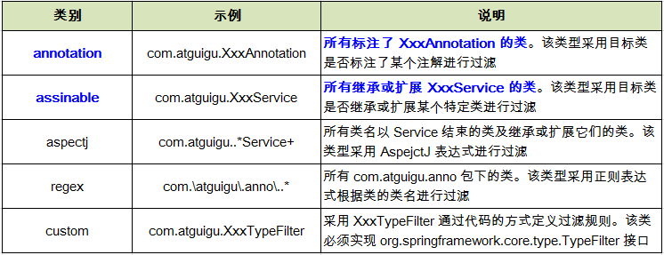


###### 组件装配：@Autowired和@Resource、@Inject注解

> <context:component-scan> 元素还会自动注册 AutowiredAnnotationBeanPostProcessor 实例（Bean的后置处理器，作用是：在配置bean之前和之后进行操作的）, 该实例可以自动装配具有 **==@Autowired==** 和 **@Resource** 、**@Inject**注解的属性.

根据上面配置：

UserService.java

```java
@Service
public class UserService {

    @Autowired
    private UserRepository userRepository;

    public void add() {
        System.out.println("UserService add");
        userRepository.save();
    }
}
```

UserController.java

```java
@Controller
public class UserController {

    @Autowired
    private UserService userService;

    public void execute() {
        System.out.println("UserController execute...");
        userService.add();
    }
}
```

调用：

```java
        ClassPathXmlApplicationContext ctx = new ClassPathXmlApplicationContext("beans-annotation.xml");
        UserController userController = (UserController) ctx.getBean("userController");
        System.out.println(userController);
        userController.execute();
        // 关闭IOC容器
        ctx.close();
```

输出：

> com.cxx.annotation.controller.UserController@32eebfca
> UserController execute...
> UserService add
> UserRepostity save...

###### 组装配置 @Autowired说明：**@Autowired按byType自动注入**

> @Autowired 注解自动装配**具有兼容类型**的单个 Bean属性
>
> - **构造器, 普通字段(即使是非 public), 一切具有参数的方法都可以应用@Authwired 注解**
> - **默认情况下, 所有使用 @Authwired 注解的属性都需要被设置. 当 Spring 找不到匹配的 Bean 装配属性时, 会抛出异常,** ==若某一属性允许不被设置, 可以设置 @Authwired 注解的 required 属性为 false==
> - 默认情况下, 当 IOC 容器里存在多个类型兼容的 Bean 时, 通过类型的自动装配将无法工作. 此时可以在 **@Qualifier** 注解里提供 Bean 的名称. **Spring 允许对方法的入参标注 @Qualifiter 已指定注入 Bean 的名称**
> - @Authwired 注解也可以应用在**数组类型**的属性上, 此时 Spring 将会把所有匹配的 Bean 进行自动装配.
> - @Authwired 注解也可以应用在**集合属性**上, 此时 Spring 读取该集合的类型信息, 然后自动装配所有与之兼容的 Bean. 
> - @Authwired 注解用在 **java.util.Map** 上时, 若该 Map 的键值为 String, 那么 Spring 将自动装配与之 Map 值类型兼容的 Bean, 此时 Bean 的名称作为键值

1.构造器, 普通字段(即使是非 public), 一切具有参数的方法都可以应用@Authwired 注解

具体例子；

```java
	private UserRepository userRepository;

    @Autowired
    public void setUserRepository(UserRepository userRepository) {
        this.userRepository = userRepository;
    }
```

2.**默认情况下, 所有使用 @Authwired 注解的属性都需要被设置. 当 Spring 找不到匹配的 Bean 装配属性时, 会抛出异常,** ==若某一属性允许不被设置, 可以设置 @Authwired 注解的 required 属性为 false==

具体例子：

```java
@Service
public class UserService {

    @Autowired(required = false)
    private TestObject testObject;
```

3.默认情况下, 当 IOC 容器里存在多个类型兼容的 Bean 时, 通过类型的自动装配将无法工作. 此时可以在 **@Qualifier** 注解里提供 Bean 的名称. **Spring 允许对方法的入参标注 @Qualifiter 已指定注入 Bean 的名称**

> 说明：由于@Autowired注释是根据byType来进行注入装配的。
>
> 于是乎在下面的例子中：展示的是两个类共同实现同一个接口，并同时配置bean。-》 于是乎，他们两个类是在注入到接口的时候都是该接口的类型


例子：有一个接口

```java
public interface UserRepository {
    void save();
}
```

两个实现类:共同配置bean

第一种情况：

------

UserRepositoryImpl.java

```java
@Repository
public class UserRepositoryImpl implements UserRepository {
    public void save() {
        System.out.println("UserRepostity save...");
    }
}
```

UserJdbcRepository.java

```java
@Repository
public class UserJdbcRepository implements UserRepository {
    public void save() {
    }
}
```

注入的时候

```java
    @Autowired
    private UserRepository userRepository;
```

这时会报错。

则注入的时候需要修改成精准配置

```java
    @Autowired
    @Qualifier(value = "userJdbcRepository")
    private UserRepository userRepository;
```

首先要明白一点：在配置自动Bean的时候@Repository 如果不设定value值，使用默认的命名策略（使用非限定类名，第一个字母小写）。那么@Qualifier--精准配置一个组件的名称，则不会在@Autowird中进行出错了（@Autowird中根据类的类型进行装配的byType）。@Qualifier(value = "userJdbcRepository") 中的userJdbcRepository是没有配置的。但是在UserJdbcRepository使用了默认命名策略而形成的。

------

第二种情况：

UserRepositoryImpl.java

```java
@Repository("userRepository")
public class UserRepositoryImpl implements UserRepository {
    public void save() {
        System.out.println("UserRepostity save...");
    }
}
```

UserJdbcRepository.java

```java
@Repository
public class UserJdbcRepository implements UserRepository {
    public void save() {
    }
}
```

注入的时候

```java
    @Autowired
    private UserRepository userRepository;
```

这时不会出错

调用的时候：

```java
        ClassPathXmlApplicationContext ctx = new ClassPathXmlApplicationContext("beans-annotation.xml");
        UserController userController = (UserController) ctx.getBean("userController");
        System.out.println(userController);
        userController.execute();
```

结果：

> com.cxx.annotation.controller.UserController@13eb8acf
> UserController execute...
> UserService add
> userRepositypcom.cxx.annotation.reposity.**UserRepositoryImpl**@51c8530f
> UserRepostity save...

原因：

> @Repository("userRepository")配置的bean的id（命名）是userRepository和  @Autowired自动装配的类的命名是一致的。并且@Repository配置的bean是@Autowired注入的类的实现类，那么@Repository配置的bean可以向上转型，不会报错。就类似于下面代码的情况：
>
> ```java
> UserRepository userReposity = (UserRepository) ctx.getBean("userRepository");
> System.out.println(userReposity);
> ```
>
> 

整一个自动装配的流程我猜测应该是这样：

> 1. @Autowired 自动注入的时候根据类（UserRepository）的类型（UserRepository.class）在IOC容器中来找出是这个类的bean（UserRepository找不到）。
>
> 2. 由于是接口找不到的组件话，那么会在IOC容器中找他的实现类的组件-bean。如果IOC容器中有该接口多个实现类的组件的话，注入的解决方案便是根据注入类的对象（实例）名称（userRepository），来获取IOC中是该接口实现类的组件并且命名为类的对象（实例）名称。以下面来说明
>
>    配置的时候：
>
>    ```java
>    @Repository("userRepository_Name")
>    public class UserRepositoryImpl implements UserRepository 
>    ```
>
>    注入的时候
>
>    ```java
>        @Autowired
>        private UserRepository userRepository_Name;
>    ```
>
>    。否则的话，则会报错说有多个类型的，无法正常匹配并注入。
>
>    ​

可参考学习该[链接](https://blog.csdn.net/u013257679/article/details/52295106)的知识

###### 使用 @Resource 或 @Inject 自动装配 Bean

> - Spring 还支持 @Resource 和 @Inject 注解，这两个注解和 @Autowired 注解的功用类似
> - **==@Resource 注解要求提供一个 Bean 名称的属性，若该属性为空，则自动采用标注处的变量或方法名作为 Bean 的名称==**
> - @Inject 和 @Autowired 注解一样也是按类型匹配注入的 Bean， 但没有 reqired 属性
> - 建议使用 @Autowired 注解


